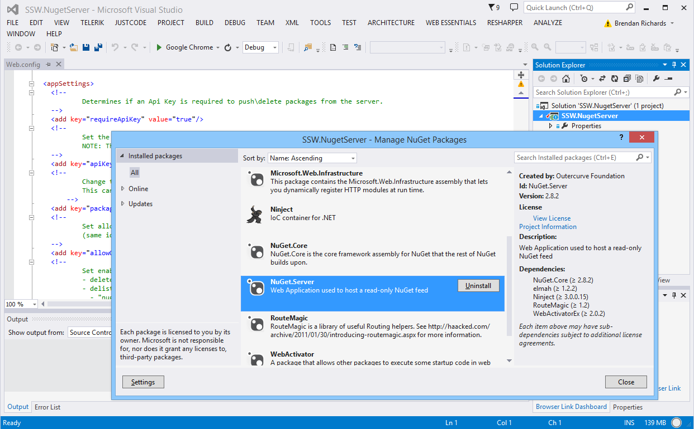
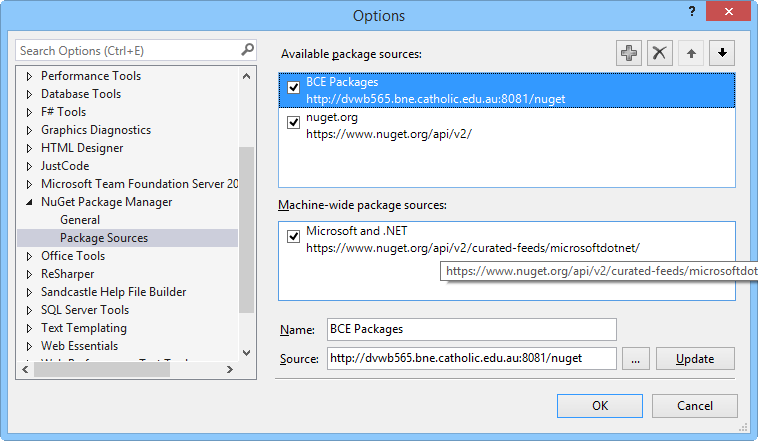

Nuget is great for managing publicly available packages, but it’s also surprisingly easy to create and publish your own packages to your own nuget server for internal code reuse across multiple solutions.

 <excerpt class='endintro'></excerpt> 
<dl class="image"><dt> 
       </dt><dd>Figure: You can create your own nuget server by simply creating a new asp.net web project and adding the Nuget.Server package</dd></dl><dl class="image"><dt> 
      
   </dt><dd>Figure: Add your new server as a package source under Tools | Options | Nuget Package Manager | Package Sources</dd></dl>

