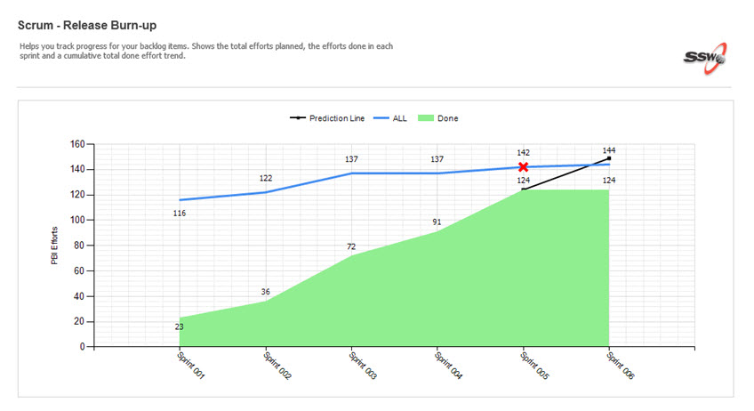
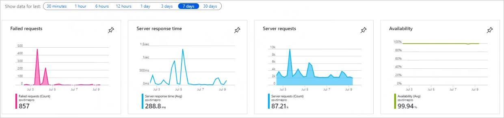

After any Sprint Review and Retrospective, an email should be sent to all the stakeholders to update them on the outcome from the sprint:

<!--endintro-->

Firstly, Create a new email copying the information from the previous sprint review/retro. As per [https://ssw.com.au/rules/do-you-know-what-happens-at-a-sprint-retrospective-meeting](https://www.ssw.com.au/rules/do-you-know-what-happens-at-a-sprint-retrospective-meeting), it should include the following:

::: email-template
|          |     |
| -------- | --- |
| From:    | &lt;Your Name&gt; |
| To:      | &lt;Product Owner&gt; |
| Cc:      | SSWSprintReviews@sswcom.onmicrosoft.com |
| Subject: | &lt;Product Owner&gt; Sprint XX Review/Retro |
::: email-content  

### Hi &lt;Product Owner&gt;,

Here are the Sprint Goals and their status at a glance:

Sprint Goals (in priority order):

* Bugfixes – Done ✅
* WDM Integration – Done ✅
* SSO/Roles APIs – In Progress 🕑
* Download Documents APIs  – Not Done ❌

Please see below for a more detailed breakdown of the Sprint:

| Sprint in Review: | &lt;Sprint Number&gt;            |
| ----------------- | -------------------------------- |
| Sprint Duration:  | &lt;Number of weeks&gt;          |
| Project:          | &lt;Project Name&gt;             |
| Project Portal:   | &lt;Link to project Portal&gt;   |
| Test Environment: | &lt;Link to test environment&gt; |
| Product Owner:    | &lt;Product Owner Name&gt;       |

Attendees:        *(Optional as they may be in the to and CC)*

### Sprint Review

| **ID** | **Title**                           | **State** | **Effort** |
| ------ | ----------------------------------- | --------- | ---------- |
| 24124  | UI Improvements                     | Done      | 4          |
| 24112  | Integrate Business Logic to MVC app | Done      | 8          |
| 24097  | Styling                             | Committed | 16         |

**Figure: Sprint Backlog from &lt;Link to Sprint Backlog in Azure DevOps&gt;** 

1. Sprint Burndown (a quick overview of the sprint)

2. Code Coverage (hopefully tests are increasing each sprint)
   XXX
3. Velocity        *(Optional)*
   XXX
4. Burnup (for the release - the whole project, how are we tracking for the big picture?)

5. Production Deployments (How many times did we deploy to Production?)

6. Application Health Overview Timeline (For the entire Sprint)

### R&D

**Did we do any experimental work?**

&lt;insert details of any trial/error processes, and ensure all detail is captured as per https://rules.ssw.com.au/do-you-record-your-failures&gt;

&lt;insert details of any problems for which no solutions existed, and ensure detail is captured as per https://rules.ssw.com.au/do-you-record-your-research-under-the-pbi&gt;

### Sprint Retrospective

As part of our commitment to inspect and adapt as a team we conduct a Sprint Retrospective at the end of every Sprint. Here are the results of our Sprint Retrospective:

**What went well?** 
&lt;insert what went well from retro&gt;

**What didn’t go so well?** 
&lt;insert what did not went well from retro&gt;

**What improvements will be made for the next Sprint?** 
&lt;insert what improvements will be made for the next Sprint&gt;

**Definition of Ready** ***\- Optional***

&lt;insert the definition of Ready. Normally that the PBIs are Sized with Acceptance criteria added&gt;

**Definition of Done** ***\- Optional***

&lt;insert Definition of Done. Normally that it compiles, meets the acceptance criteria, and a test please has been sent if relevant&gt;

&lt;This is as per the rule:        [https://rules.ssw.com.au/do-you-create-a-sprint-review-retro-email](/do-you-create-a-sprint-review-retro-email) /&gt;

:::
:::  

::: good
**Figure: Good Example - Template for Sprint Review/Retro Email. Subject: Sprint xxx Review/Retro**
:::