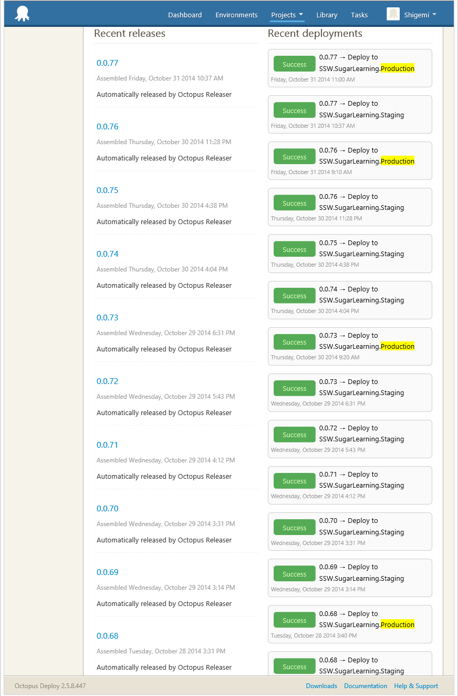

After any Sprint Review and Retrospective, an email should be sent to all the stakeholders to update them on the outcome from the sprint:

<!--endintro-->

* Subject: <client name=""> Sprint XX Review/Retro </client>
* This is a reply to the        [Sprint Forecast email](/Pages/Do-you-create-a-Sprint-Forecast-email.aspx)
* Screenshot of Burndown from Azure DevOps
* Breakdown of work completed (including current code coverage value)
* Link to test environment
* Relevant notes from the retrospective
* CC - SSWSprintReviews@sswcom.onmicrosoft.com

Hi [Product Owner],

| Sprint in Review:  | [Sprint Number] |
| --- | --- |
| Sprint Goal:  | [Goal] |
| Sprint Duration:  | [Number of weeks] |
| Project:  | [Project Name] |
| Project Portal:  | [Link to project Portal] |
| Test Environment:      | [Link to test environment] |
| Product Owner:  | [Product Owner Name] |

Attendees:        *(Optional as they may be in the to and CC)*

### Sprint Review

| **ID**  | **Title**  | **State**  |  **Effort**   |
| --- | --- | --- | --- |
| 24124   | UI Improvements  | Done  | 4  |
| 24112   | Integrate Business Logic to MVC app    | Done | 8  |
| 24097   | Styling  | Committed    | 16  |

**Figure: Sprint Backlog from [Link to Sprint Backlog in Azure DevOps]** 

As per [https://rules.ssw.com.au/do-you-know-what-happens-at-a-sprint-retrospective-meeting](/_layouts/15/FIXUPREDIRECT.ASPX?WebId=3dfc0e07-e23a-4cbb-aac2-e778b71166a2&TermSetId=07da3ddf-0924-4cd2-a6d4-a4809ae20160&TermId=4f02d28d-5375-4530-abcb-0b541683bcbc), we review:

1. Sprint Burndown (a quick overview of the sprint)
<dl class="image">&lt;dt&gt;
         
      &lt;/dt&gt;<dd>Figure: Sprint Burndown</dd></dl>
2. Code Coverage (hopefully tests are increasing each sprint)
XXX

3. Velocity        *(Optional)*
XXX

4. Burnup (for the release - the whole project, how are we tracking for the big picture?)
<dl class="image">&lt;dt&gt;
         
      &lt;/dt&gt;<dd>Figure: Release Burnup</dd></dl>
5. Production Deployments (How many times did we deploy to Production?)
<dl class="image">&lt;dt&gt;
         
      &lt;/dt&gt;<dd>Figure: Deployments from Octopus Deploy</dd></dl>
6. Application Health Overview Timeline (For the entire Sprint)

### R&D 

**Did we do any experimental work?
**

<insert details="" of="" any="" trial/error="" processes,="" and="" ensure="" all="" detail="" is="" captured="" as="" per="" https://rules.ssw.com.au/do-you-record-your-failures=""> </insert>

<insert details="" of="" any="" problems="" for="" which="" no="" solutions="" existed,="" and="" ensure="" detail="" is="" captured="" as="" per="" https://rules.ssw.com.au/do-you-record-your-research-under-the-pbi="">  </insert>

### Sprint Retrospective

As part of our commitment to inspect and adapt as a team we conduct a Sprint Retrospective at the end of every Sprint. Here are the results of our Sprint Retrospective:

**What went well?** 
<insert what="" went="" well="" from="" retro=""> </insert>

**What didn’t go so well?** 
<insert what="" did="" not="" went="" well="" from="" retro=""></insert>

**What improvements will be made for the next Sprint?** 
<insert what="" improvements="" will="" be="" made="" for="" the="" next="" sprint=""></insert>

**Definition of Ready** ***- Optional***

<insert the="" definition="" of="" ready.="" normally="" that="" the="" pbis="" are="" sized="" with="" acceptance="" criteria="" added=""></insert>

**Definition of Done** ***- Optional***

<insert definition="" of="" done.="" normally="" that="" it="" compiles,="" meets="" the="" acceptance="" criteria,="" and="" a="" test="" please="" has="" been="" sent="" if="" relevant=""></insert>

<this is="" as="" per="" the="" rule:=""></this>[https://rules.ssw.com.au/do-you-create-a-sprint-review-retro-email](/_layouts/15/FIXUPREDIRECT.ASPX?WebId=3dfc0e07-e23a-4cbb-aac2-e778b71166a2&TermSetId=07da3ddf-0924-4cd2-a6d4-a4809ae20160&TermId=2a845add-b4b9-45ac-b47f-c646fe7d0c40) />

**Figure: Good Example - Template for Sprint Review/Retro Email. Subject: Sprint xxx Review/Retro**
