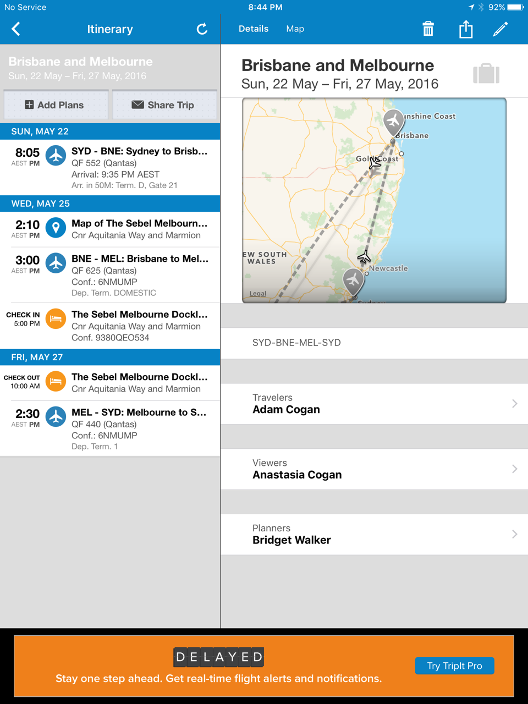

As well as sending details of bookings to the traveler's outlook calendar, we also use tripit.com to consolidate the details of bookings for flights, hotels, car rentals, etc. TripIt can make a single, easy-to-read online itinerary that can be viewed by anyone you choose to share the link with, making it easy to keep co-travelers, spouses, co-workers, etc. in the loop.

After joining tripit.com, forward a copy of each booking confirmation to plans@tripit.com to store the details of upcoming journeys. Multiple items can then be merged to form one master itinerary that covers the whole trip.

For more information or to join, visit [tripit.com](https://www.tripit.com/)

<!--endintro-->
