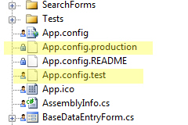

Every application has different settings depending on the environment it is running on, e.g. production, testing or development environment.
 It is much easier and efficient if app.config is provided in several environment types, so then the developer can just copy and paste the required app.config.

Figure: Bad Example - Only 1 App.config provided

Figure : Good Example - Several App.config are provided
<!--endintro-->
