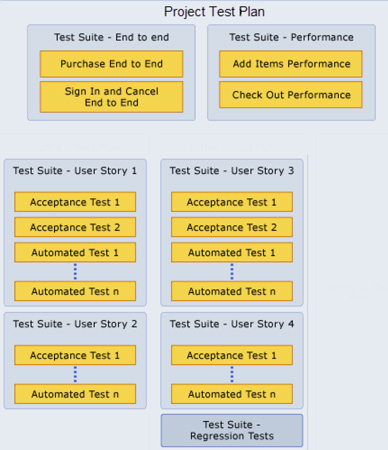

When you use Microsoft Test Manager to create test plans and test suites for your team project, there are several approaches that you can take.  

<!--endintro-->

You may only create 1 test plan that you use for all milestones and add test suites and tests as you progress. This is bad because if you use this approach, you do not have historical data for your test pass rates for previous milestones.

::: bad  
  
:::

By creating test plans for each Sprint, you can see when a Sprint is complete, based on your testing goals. You can also prepare the test plan for the next Sprint while you complete your testing for the current Sprint.

By using this approach, you can track your testing progress for each of your test plans and see that the quality of your application is improving.

::: good  
  
:::

**Tip:** If you add both manual and automated tests to your test suites, you can view the overall quality based on both of these types of tests for your test suites and test plans.

**Reference:** [Guidance for Creating Test Plans and Test Suites](http://msdn.microsoft.com/en-us/library/ff972304.aspx)
