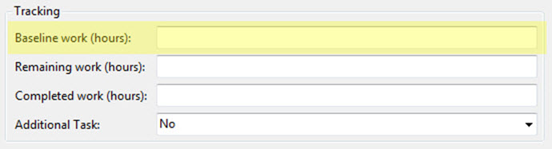
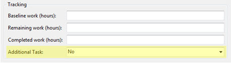
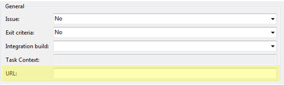
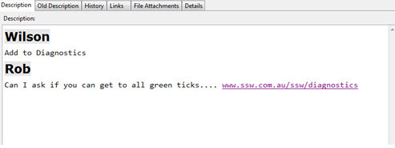

The built-in Process Templates in TFS will not always fit into your environment, so you can fix it by creating your own. 

<!--endintro-->

::: good  
  
:::

::: good  
  
:::

::: good  
  
:::

::: good  
  
:::

**Note:** The URL field is used in the [SSW Smashing Barrier](https://smashingbarrier.com).

