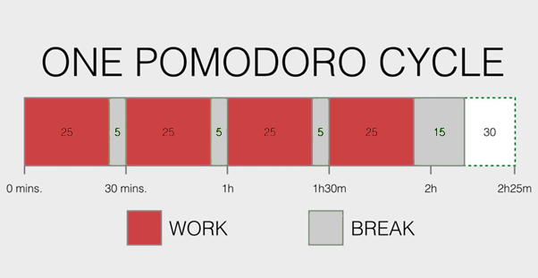

<b>​​Keeping your mind on the job </b>is very important, especially when you're trying to fix a bug/issue or finalize a task to meet this afternoon's deadline. Here is how you keep "in the zone":​

 

 <excerpt class='endintro'></excerpt> 
<ol><li>​Refer people to standards and you will be helping them learn + reducing the number of interruptions they get. This is why we invest in the SSW Rules.​ </li><li>Avoid multi-tasking as much as possible. Don't open an email, respond to half the questions, and then open another. Complete the first task and then delete the email. When you multi-task, there’s a higher chance your work quality will be dropped, as well as your attention to detail. </li><li>Set your Browser's default to "About: Blank"  so you don't get distracted by news or social media, for example. <b>Tip:​​ </b>There is an extension for Google Chrome to replace your homepage called 
      <a href="https://chrome.google.com/webstore/detail/momentum/laookkfknpbbblfpciffpaejjkokdgca?hl=en-US">Momentum​</a>, where you will be shown a photograph as the background, time, greetings, and your own focus for the day. </li><li>Minimize Phone distractions. If you are in a meeting, it’s a good idea to put your mobile phone to “do not disturb”. </li><li>
      <a href=/do-you-minimize-team-distractions>Minimize Microsoft Teams distractions​</a>. </li><li>
      <a shape="rect" href=/do-you-minimize-your-outlook-distractions>Minimize Outlook distractions</a>.</li><li>
      <a shape="rect" href=/minimize-skype-distractions>Minimize Skype distractions</a>. </li><li>People should 
      <a href=/do-you-not-interrupt-people-when-they-are-in-the-zone>avoid distracting you</a> - using IM unnecessarily can be evil. See <a href=/important-chats-should-be-in-an-email>Do you know important chats should be in an email?​</a> </li><li>People will interrupt you less if you let them know what you are working on. <b>Tip: </b>Use the Teams status to let people know what you are doing (saves them having to ask you). See <a href=/use-the-status-message-in-teams>Do you use the status message in Teams?</a> </li><li>Whenever you can, programming/working in pairs is great as it means you will be forced to focus, you won't cruise the web, or play Solitaire. </li><li>Use a concentration technique, such as 
      <a href="https://en.wikipedia.org/wiki/Pomodoro_Technique">Pomodoro​</a>.  </li></ol><dl class="image"><dt>   </dt><dd>Figure: Multi-tasking can be your deadline's enemy</dd></dl><dl class="image"><dt>​​</dt><dd>​​Figure: The ​Pomodoro technique <strong style="color:#444444;">uses a timer to break down work into intervals, traditionally 25 minutes in length, separated by short breaks.</strong></dd><strong style="color:#444444;"></strong></dl><strong style="color:#444444;"> </strong>

