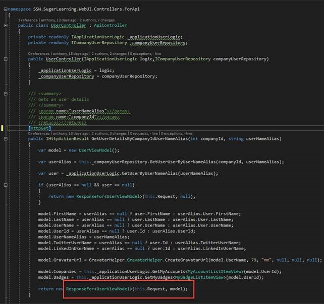
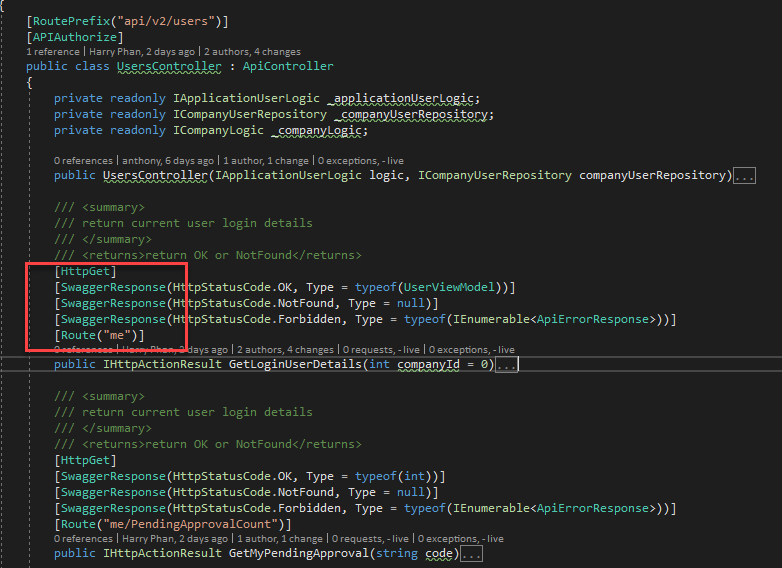

It is important to define your response types.
<dl class="badImage"><dt></dt>
dd>​Figure: Bad example – no response types
</dl><dl class="goodImage"><dt></dt><dd>Figure: Good example – Response types (in .NET)</dd>
</dl>
 <excerpt class='endintro'></excerpt> 

 

/// 
 /// Returns the nth number in the fibonacci sequence. /// 
 /// <param name="n">The index (n) of the fibonacci sequence</param> /// <returns>Returns the nth fibonacci number.</returns> /// <response code="200">int64</response> [HttpGet] [ProducesResponseType(200)] [ProducesResponseType(400)] [ResponseCache(CacheProfileName = DefaultCacheProfile.Name)] [Produces("application/json", "text/json")] public ActionResult<long> Get(long n) { _logger.LogInformation($"Fibonacci number {n} requested"); if(!_fibonacciSolver.CanSolve(n)) return new BadRequestResult(); try { return _cache.GetOrAdd($"Fibonacci{n}", () => _fibonacciSolver.Solve(n)); } catch (ArgumentOutOfRangeException) { return new BadRequestResult(); } }
<dd class="ssw15-rteElement-FigureBad">Figure: Good example for swashbuckle - Even b​etter if you have .NET Core 2.1 use the strong typed ActionResult – see yellow​​  </dd>
        [HttpGet]         [SwaggerResponse(HttpStatusCode.OK, typeof(long))]         [SwaggerResponse(HttpStatusCode.BadRequest, typeof(void))]         public ActionResult<long> Get(long n)         {             _logger.LogInformation($"Fibonacci number {n} requested");                          if(!_fibonacciSolver.CanSolve(n))                 return new BadRequestResult();               try             {                 return _cache.GetOrAdd($"Fibonacci{n}", () => _fibonacciSolver.Solve(n));             }             catch (ArgumentOutOfRangeException)             {                 return new BadRequestResult();             }         }
<dd class="ssw15-rteElement-FigureGood">Figure: Good example for nswag - Even better if you have .NET Core 2.1 use the strong typed ActionResult – see yellow​​  </dd>

