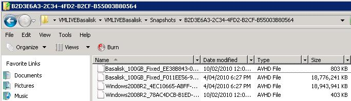

Snapshots are a very handy tool for a System Administrator, but they can quickly turn into a nightmare if they are not managed properly. Snapshots take far more hard drive space than a virtual machine without, and if you don’t clean up your snapshots you may run out of drive space.   
<!--endintro-->

 
Figure: Snapshots are useful, but they can take up a lot of space
When you delete a snapshot you can no longer restore the virtual machine to the point in time the snapshot was taken. Deleting a snapshot does not affect any other snapshots, nor will it affect the current state of the virtual machine.

Set yourself a calendar reminder 3 weeks after you make a snapshot so you remember to apply the snapshot to the Virtual Machine (assuming you are happy with the virtual machine after the snapshot).

1. In the  **Hyper-V Manager** , click on the virtual machine you want to apply the snapshot to
2. In the  **Snapshots** window, right click on the snapshot you wish to apply and click  **Delete Snapshot…**
3. Confirm the snapshot deletion.
4. Wait for the merge process to complete (this may take a while if you have had the snapshot running for a long time and it has grown large in size).
