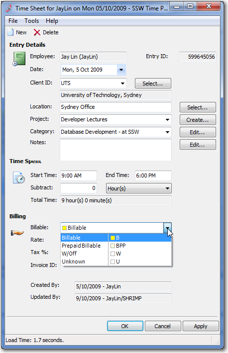
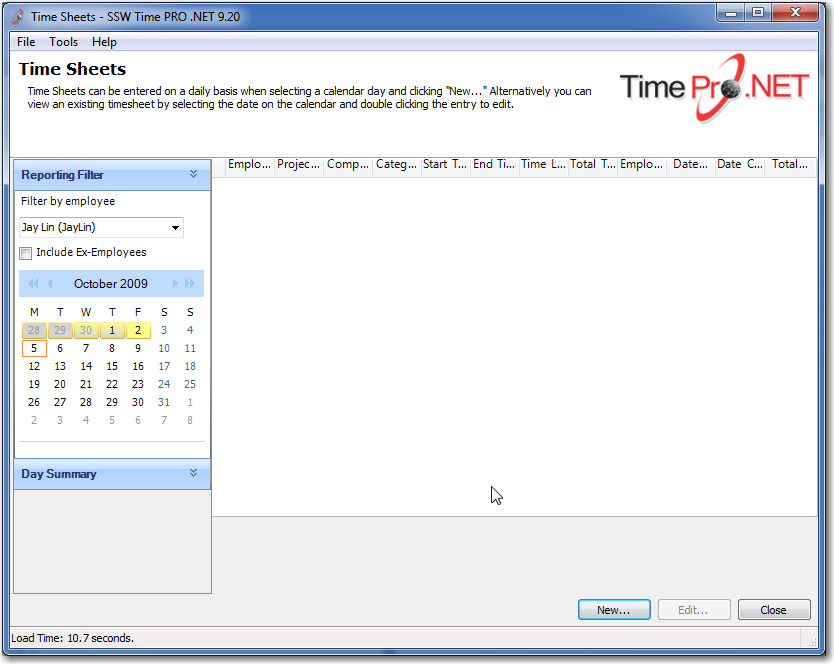

Lookup data is data that you usually see in combo boxes. It may be a Customer Category, a Product Color or the Order Status. Usually this is defined by the user and the programmer does not care what or how many records they have. When the programmer relies on records being in the lookup table, it is called 'Controlled Lookup Data'. 

 So whenever you have special data, which is referenced in code you need to tread carefully by:   
<!--endintro-->

1. First understanding that although most of the time there is a clear separation between data and schema, there is an exception for Controlled Lookup Data. This is when data (aka Controlled Lookup Data) is tightly coupled to the application, meaning that you have an application that cannot function correctly without that data.
2. You need to deploy that 'Controlled Lookup Data'
3. You then need to add a check for it so that it does not disappear.

Let's look at an example:

  

  


```
if (drDay.NotBillableCount == 0 && 
    drDay.BillableCount > 0)
{
    //Yellow Background
    cell.BackColor = Color.FromArgb(255, 255, 140);
    cell.BackColor2 = Color.FromArgb(255, 255, 140);
}
else if (drDay.BillableCount > 0)
{
    cell.BackColor = Color.FromArgb(255, 255, 140);
    cell.BackColor2 = Color.LightGray;
}
else
{
    cell.BackColor = Color.LightGray;
    cell.BackColor2 = Color.LightGray;
}
```


**Figure: I think we have "Controlled Lookup Data" here, because if the "BillableCount" is greater than 0, the color shown will be yellow**

## Modern Frameworks (EF)

Entity Framework allows for [Data Seeding](https://docs.microsoft.com/en-us/ef/core/modeling/data-seeding) which is the process of populating a database with an initial set of data. This is perfect for populating controlled lookup data. 

## Legacy Applications 

For older applications, create SQL scripts like the example below.  

```
INSERT INTO dbo.[EmpTimeBillable] 
    ([CategoryID], [CategoryName], [DateCreated], 
    [DateUpdated], [EmpUpdated], [Note], [rowguid], 
    [Colour]) 
VALUES 
    ('ALL', '', '09/13/2009 00:00:00', 
    '09/13/2009 00:00:00', 
    'SSW-AdamCogan', 
    'Used for reports - 
     Excluded in Timesheets and Tasklist data entry', 
    '{A9A009A9-4E19-4FD3-B86A-B9260067D0EF}', 
    'White')
GO
INSERT INTO dbo.[EmpTimeBillable] 
    ([CategoryID], [CategoryName], [DateCreated], 
    [DateUpdated],[EmpUpdated], [Note], [rowguid], 
    [Colour]) 
VALUES 
    ('B', 'Billable', '07/01/2009 00:00:00', 
    '07/01/2009 00:00:00', 
    'SSW-AdamCogan', 
    'DON’T CHANGE - These are hard coded', 
    '{F410C25D-1F1A-4340-B7A4-7A4AAE037708}', 
    'Yellow')
GO
INSERT INTO dbo.[EmpTimeBillable] 
    ([CategoryID], [CategoryName], [DateCreated], 
    [DateUpdated], [EmpUpdated], [Note], [rowguid], 
    [Colour]) 
VALUES 
    ('BPP', 'Prepaid Billable', '02/28/2009 15:30:19', 
    '02/28/2009 00:00:00', 
    'SSW-AdamCogan', 
    'DON’T CHANGE - These are hard coded', 
    '{608AA6FF-B3C5-47BE-AC9A-29553E89643D}', 
    'LightYellow')
GO
INSERT INTO dbo.[EmpTimeBillable] 
    ([CategoryID], [CategoryName], [DateCreated], 
    [DateUpdated], [EmpUpdated], [Note], [rowguid], 
    [Colour]) 
VALUES 
    ('U', 'Unknown', '07/01/2009 00:00:00', 
    '07/01/2009 00:00:00', 
    'SSW-AdamCogan', 
    'DON’T CHANGE - These are hard coded', 
    '{74937D60-D2B2-4A4D-96AD-7F5B1941B244}', 
    'White')
GO
INSERT INTO dbo.[EmpTimeBillable] 
    ([CategoryID], [CategoryName], [DateCreated], 
    [DateUpdated], [EmpUpdated], [Note], [rowguid], 
    [Colour]) 
VALUES 
    ('W', 'W/Off', '07/01/2009 00:00:00', 
    '07/01/2009 00:00:00', 
    'SSW-AdamCogan', 
    'DON’T CHANGE - These are hard coded', 
    '{D51513CE-8A1D-41E4-93C4-3E827FF7522B}', 
    'LavenderBlue')
GO
```


**Figure: This data must be deployed, just like we deploy a schema.**

::: greybox
**Note**: Now you need to add a test for your controlled data. Check out [Do you check your "Controlled Lookup Data" (aka Reference Data) is still there?](/do-you-check-your-controlled-lookup-data)
:::