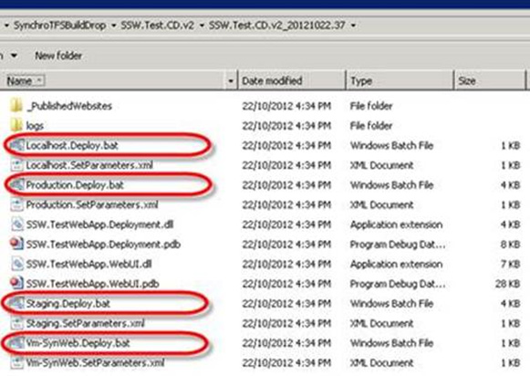

Once you have configured “Build Once, Deploy Many” you can open the folder for any build on the build server and deploy any build, to any environment.

<!--endintro-->

This means that if you deploy version 37, and then want to roll back to version 36 simply open the folder for 36 and re-run that batch file (assuming there has been no breaking DB schema changes).

::: todo
TODO: AdamS – Write a rule on non-breaking Schema changes
:::

