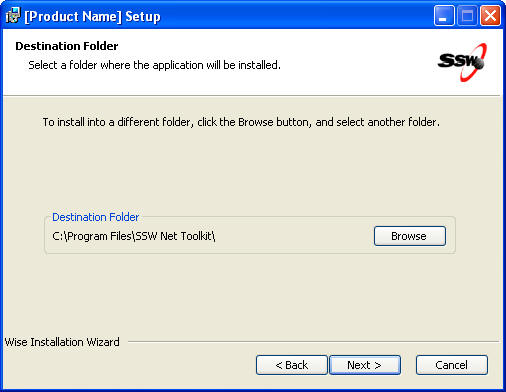

​
Many applications end up working perfectly on the developer's machine. However once the application is deployed into a setup package and ready for the public, the application could suddenly give the user the most horrible experience of his life. There are plenty of issues that developers don't take into consideration. Amongst the many issues, three can stand above the rest if the application isn't tested thoroughly:​ 

 <excerpt class='endintro'></excerpt> 
<ol><li>The SQL Server Database or the Server machine cannot be accessed by the user, and so developer settings are completely useless to the user.</li><li>The user doesn't install the application in the default location. (i.e. instead of C:\Program Files\ApplicationName, the user could install it on D:\Temp\ApplicationName)</li><li>The developer has assumed that certain application dependencies are installed on the user's machine. (i.e. MDAC; IIS; a particular version of MS Access; or SQL Server runtime components like sqldmo.dll)</li></ol>
To prevent issues from arising and having to re-deploy continuously which would only result in embarrassing yourself and the company, there are certain procedures to follow to make sure you give the user a smooth experience when installing your application.
<ol><li>Have scripts that can get the pathname of the .exe that the user has installed the application on  
       Wise has a Dialog that prompts the user for the installation directory: <dl class="goodImage"><dt>  </dt><dd>Figure: Wise Prompts the user for the installation directory and sets the path to a property in wise called "INSTALLDIR"</dd></dl>
An embedded script must be used if the pathname is necessary in the application (i.e. like .reg files that set registry keys in registry)
<dl class="goodCode"><dt><pre>'The .reg file includes the following hardcoded lines:

 '[HKEY_CLASSES_ROOT\SSWNetToolkit\shell\open\command]​
  
               <a href="mailto:%27@=%22\%22C:\\Program">'@="\"C:\\Program</a> Files\\SSW NetToolKit\\WindowsUI\\bin\\SSW.NetToolkit.exe\" /select \"%1\""

 'This should be replaced with the following lines: 
 '[HKEY_CLASSES_ROOT\SSWNetToolkit\shell\open\command]

               <a href="mailto:%27@=%22\%22REPLACE_ME\">'@="\"REPLACE_ME\</a>" /select \"%1\""

  Dim oFSO, oFile, sFile 
  Set oFSO = createobject("Scripting.FileSystemObject")
           
  sFile = Property("INSTALLDIR") & "WindowsUI\PartA\UrlAcccess.reg"
                                        
  Set oFile = oFSO.OpenTextFile(sFile)

  regStream = oFile.ReadAll() 
  oFile.Close

 string appPath = replace(Property("INSTALLDIR") & "WindowsUI\bin\SSW.NetToolkit.exe", "\", "\\")

 regStream = replace(regStream, "REPLACE_ME", appPath) 
 Set oFile = oFSO.OpenTextFile(sFile,2) 
 oFile.Write regStream

 oFile.Close
</pre></dt><dd>Figure: The "REPLACE_ME" string is replaced with the value of the INSTALLDIR property in the .reg file</dd></dl></li><li>After setting up the wise file then running the build script, the application must be first tested on the developers' own machine. Many developers forget to test the application outside the development environment completely and don't bother to install the application using the installation package they have just created. Doing this will allow them to fix e.g. pathnames of images that might have been set to a relative path of the running process and not the relative path of the actual executable. <dl class="badCode"><dt><pre>  this.pictureReportSample.Image = Image.FromFile(@"Reports\Images\Blank.jpg"); </pre></dt><dd>Bad code - FromFile() method (as well as Process.Start()) give the relative path of the running process. This could mean the path relative to the shortcut or the path relative to the .exe itself, and so an exception will be thrown if the image cannot be found when running from the shortcut.</dd></dl><dl class="goodCode"><dt><pre>string appFilePath = System.Reflection.Assembly.GetExecutingAssembly().Location;

string appPath = Path.GetDirectoryName(appFilePath);

this.pictureReportSample.Image = Image.FromFile(appPath + @"\Reports\Images\Blank.jpg"); </pre></dt><dd>Good code - GetExecutingAssembly().Location will get the pathname of the actual executable and no exception will be thrown.</dd></dl>
This exception would never have been found if the developer didn't bother to test the actual installation package on his own machine.
</li><li>Having tested on the developer's machine, the application must be tested on a virtual machine in a pure environment without dependencies installed in GAC, registry or anywhere else in the virtual machine.  
      
Users may have MS Access 2000 installed and, the developer's application may behave differently on an older version of MS Access even though it works perfectly on MS Access 2003. The most appropriate way of handling this is to use programs like VM Ware or MS Virtual PC. This will help the developer test the application on all possible environments to ensure that it caters for <b>all</b> users, minimizing the amount of assumptions as possible.

      </li></ol>

