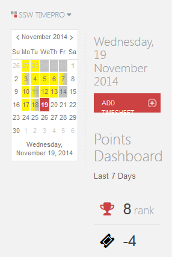

With the internet moving so fast into the world of mobile devices, it's  important to design for a variety of platforms. Many websites these days  have a unique mobile optimized site which is great for usability.

<!--endintro-->

Although mobile browsers are capable of rendering your normal  website, some functionality does not carry across. Touch screens have no  concept of "hover" so drop down menus must be activated on click.  Screen estimate and the precision of the user is impaired on touch  devices, so links and other clickable objects need to be rendered  bigger.

The key thing to remember is that a mobile phone is a  different device and have completely different use cases. EBay on a  desktop can be used for a large variety of cases, including the creation  of new bids, while EBay Mobile is primarily for checking activity while  on the move. The focus of a mobile design for EBay centers on browsing,  bidding and status updates for products - it doesn't need to cover all  cases, just the right ones.

True mobile interface design focuses that which is used on mobile and simplifies the process.
<dl class="badImage">&lt;dt&gt;
                      
                   &lt;/dt&gt;<dd>Figure: Bad Example - TimePro as it renders on mobile. It is near unusable! </dd></dl><dl class="goodImage">&lt;dt&gt;
                      
                   &lt;/dt&gt;<dd>Figure: Good Example - TimePro designed for mobile.</dd></dl>
