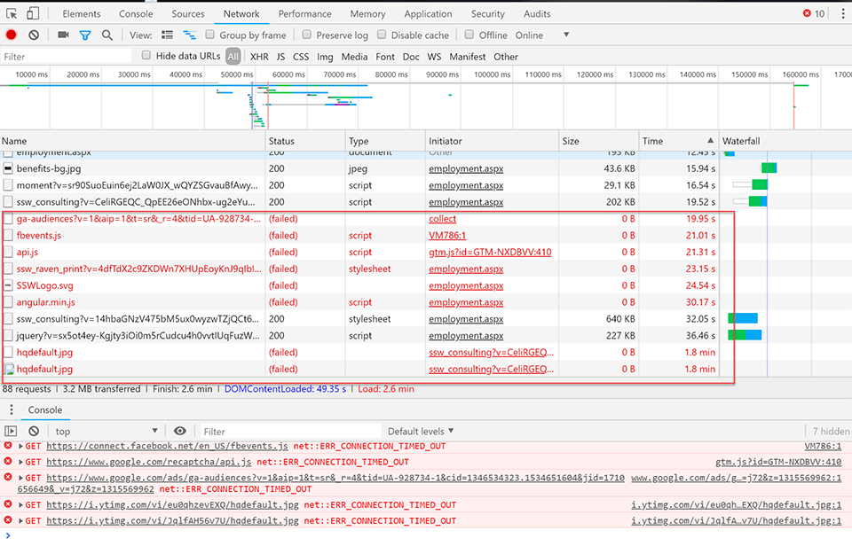
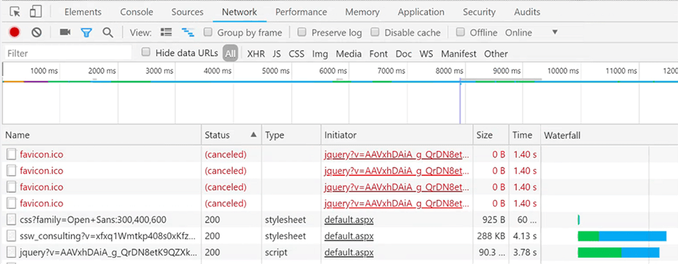
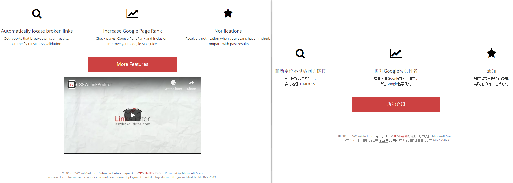

Some countries (especially China) strictly control access to various international web services. Meanwhile, as geopolitical tensions escalate, many service providers are actively restricting or blocking access to their services in specific regions like China, including Copilot, ChatGPT, Google Gemini and Claude, etc. You can use service detection to determine whether particular services are available, allowing you to fall back gracefully or use alternative providers.

<!--endintro-->

As well as from inside China, another common place where access to third-party services may be blocked is from behind corporate firewalls.

First, read this rule:     [Do you manage your 3rd party dependencies?](/do-you-manage-3rd-party-dependencies). You should always start by carefully managing the number of 3rd party services and dependencies your application or website depends on.

There are two ways to determine service availability, these are:

### Option 1: Geolocation

You can use geolocation based on client IP to determine what services are available but this has a number of disadvantages.:

* **Unpredictability** Geolocation based on IP is never perfect
 Geo-location lookup services are not perfect. here's an example: if you use the guest internet in the Microsoft offices, the internet thinks you are outside Australia (Singapore).  
 This approach won't detect services that have been blocked by a company firewall.
* **Maintenance overhead** You need to maintain lists of locations and what services are available there - which may be subject to change (however not very often)
 The list of services allowed/blocked by the "great firewall of china" is a moving target. things get blocked and unblocked all the time with little warning. we would have to keep coming back to the site to test. So there would be an overhead maintaining lists of countries and the services they allow.
* **Extra dependency** - using IP address requires taking a dependency on an extra third-party service to perform the geo-location lookups.

For these reasons, dynamic service detection is recommended in preference to solutions based on geo-location.

### Option 2: Check Connectivity  

**Universality** - China is not the only place that blocks stuff. there are other countries to consider. Also many corporate firewalls block stuff. actively detecting access to a service from the client handles all these scenarios at runtime with no prior configuration.

SSW has created a simple Service Detection library for exactly this purpose called SSW Service Detector. This is open source and available from GitHub:[SSW Service Detector](https://github.com/SSWConsulting/SSW.ServiceDetector).

This Service Detector works by attempting to download the Favicon.ico file from the website for each service you want to use. These favicon files are small, so if a service is available, the file will download very quickly. If a service is blocked, the connection could take a long time to timeout on its own. In this situation, the service detector uses a 1.5-second timer to attempt the download and will cancel the request after this time so that these connection attempts fail quickly and don't block the entire page.

::: bad  
  
:::

::: good  
  
:::

### Solutions

If, for example, your site displays videos, you can detect that YouTube is not available in China and embed YouKu videos instead. 
Both these options require service detection to operate properly. Remember that attempting to connect to a blocked service from China could take a long time to timeout, potentially adding significant loading times to your site.

**Solution 1: Remove the content**

  

**Solution 2: Provide an alternative to the blocked service**

