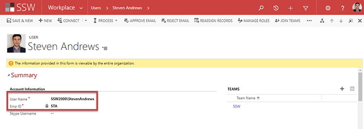

When a user is created in Active Directory (AD) a Global Unique Identifier (GUID) is also created. As the name suggests this is Unique for each user and is never duplicated in a Domain.

<!--endintro-->
<dl class="image">&lt;dt&gt;&lt;/dt&gt;<dd>Figure: GUID for User Steven Andrews</dd></dl>
When adding a user to CRM they are assigned with an Employee ID, this is linked to the AD account’s GUID.
<dl class="image">&lt;dt&gt;&lt;/dt&gt;<dd>Figure: AD User StevenAndrews is tied to STA Employee ID through AD GUID</dd></dl>
When a user leaves many companies go through the process of disabling the CRM account and then deleting the AD User.
The problem that arises from deleting the AD user is that if the Employee that left comes back to the company and a new AD account is created for them, they are no longer able to be associated with the previously created CRM account. Instead they will need a new CRM user with a different Employee ID.

This in turn make reporting on a user that has returned more difficult. So to get around this it is disabling and moving the user to a "Disable Users" Organizational Unit (OU) in AD is much easier, so that in the event that the return, the AD and CRM user can just be re-enabled.
