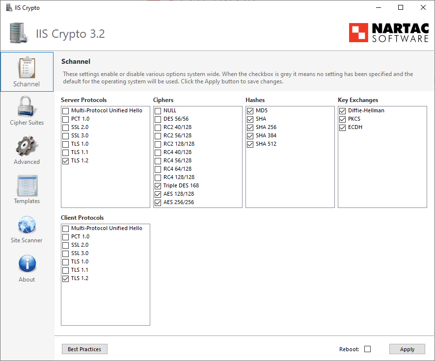

For better server security (especially regarding public facing servers), certain security protocols and ciphers should be disabled.

<!--endintro-->

Using a tool called "IIS Crypto 3.2" by [Nartac](https://www.nartac.com/Products/IISCrypto), these protocols can be easily disabled instead of having to manually edit the Registry Keys.

1. Download IIS Crypto 3.2 (https://www.nartac.com/Products/IISCrypto/Download)
2. Run this on the server you wish to lock down
3. Select the best practices button 
      
::: good  
  
:::

4. Ensure that TLS 1.0 and TLS 1.1 is also disabled | hit apply 
5. The server will need to be rebooted before the settings take effect
