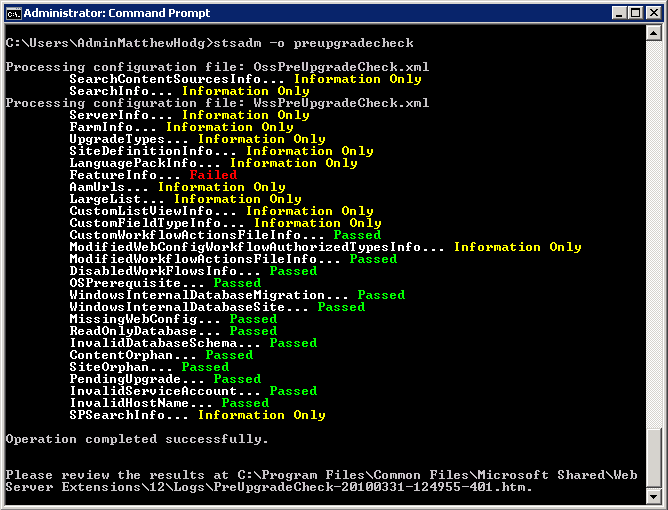

  
It is a good idea to run a pre-migration check on the SharePoint 2007 before starting the migration process.

<ol>
    <li>Check you have followed <a href="/Pages/Do-you-add-stsadm-to-environmental-variables.aspx">Do you add stsadm to the environmental variables?</a> </li>
    <li>Open up <b>cmd</b> with Administrator privileges</li>
    <li>Run the following command: <b>stsadm –o preupgradecheck 
     
    </b> <b> 
    Figure 3 - Check the pre-migration report. The only thing that is allowed to fail is “FeatureInfo”. This is because a custom feature won’t migrate and developers need to create a build targeted for SharePoint 2010</b></li>
    <li>Save the HTML file that was generated and email it to your companies SharePoint Master. (Don’t print it as its very large)</li>
    <li>Have the <a href="/Pages/Do-you-have-a-SharePoint-Master.aspx">SharePoint Master</a> sign off on the pre-migration check and inform you if there are any site collections or content sources that are no longer needed and can be ignored for migration</li>
</ol>

 

 <excerpt class='endintro'></excerpt> 

