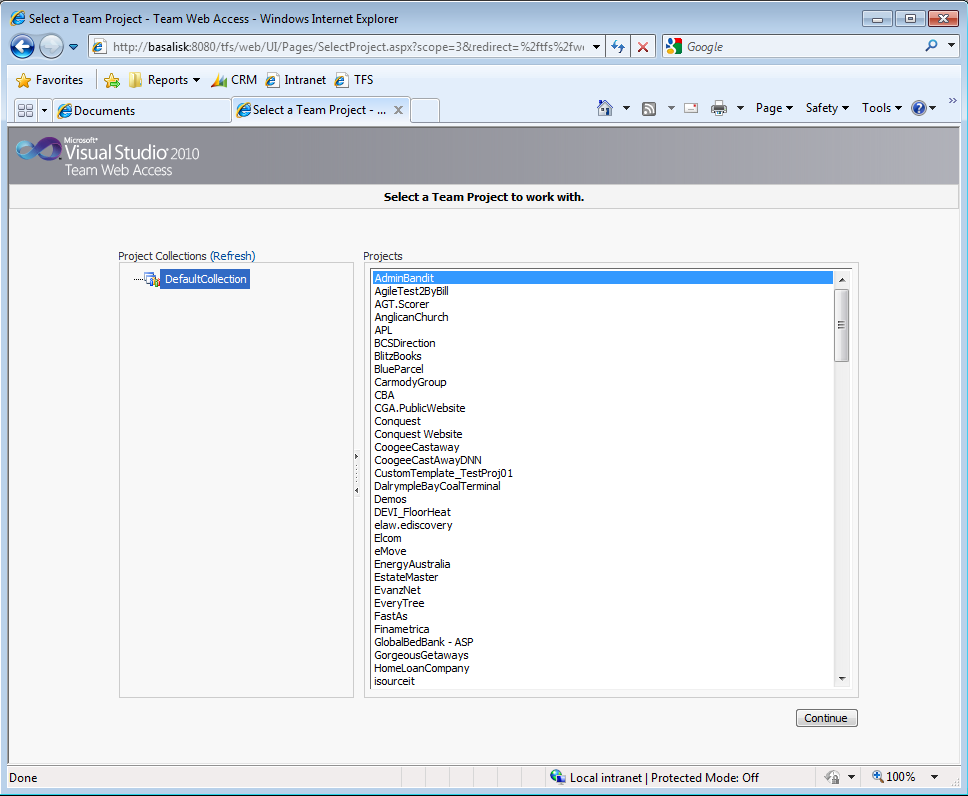

  
All of the hard work has been done, now you need to do a quick test.

<ol>
    <li>Open http://tfs.northwind.com:8080/tfs/web/ </li>
    <li>Confirm the Team Web Access page load and shows all your team projects 
      
    Figure: Make sure you can access TSWA after the upgrade.</li>
</ol>

 <excerpt class='endintro'></excerpt> 

