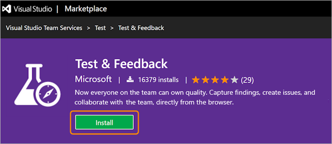
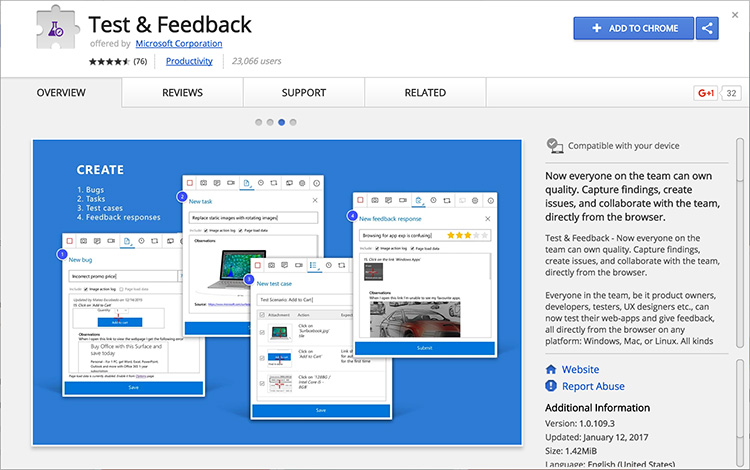
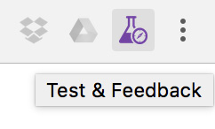
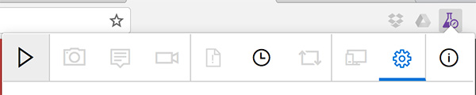
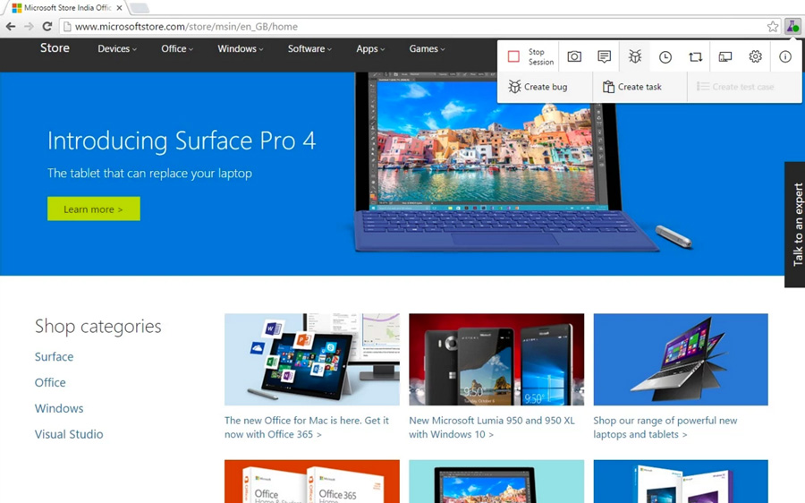

Use Microsoft's Exploratory Testing - **Test & Feedback extension** - to perform exploratory tests on web apps directly from the browser.

Capture screenshots, annotate them and submit bugs as you explore your web app - all directly from Chrome (or Firefox) browser. Test on any platform (Windows, Mac or Linux), on different devices. No need for predefined test cases or test steps. Track your bugs in the cloud with Azure DevOps.

<!--endintro-->

`youtube: https://www.youtube.com/embed/J_fmWxl1zUQ?rel=0`
**Video: Ravi walks Adam through the exploratory testing extension - You can also [watch on SSW TV](http://tv.ssw.com/6664/exploratory-testing-extension-for-visual-studio-adam-cogans-interview-with-ravi-shanker)** 

`youtube: https://www.youtube.com/embed/G5tTF0sjyTg?rel=0`
**Video: Ravi Shanker and Adam Cogan talk about the test improvements in Azure DevOps and the Chrome Test & Feedback extension  - You can also [watch on SSW TV](https://tv.ssw.com/6873/vs-test-feedback-chrome-extension-with-product-owner-ravi-shanker-microsoft-seattle-2017)** 

1. Go to Visual Studio Marketplace and install "Test & Feedback". 
      
    

2. Click "Add to Chrome" to add the extension to the browser on your computer. 
      
    

3. Go to Chrome.

4. Start a session by clicking on the Chrome extension and then click start a session. 
      
    

    

5. Upload the screenshot to a PBI. 
          
    

**More info:** [Azure DevOps - Explore work items with the Test & Feedback extension](https://docs.microsoft.com/en-us/azure/devops/test/explore-workitems-exploratory-testing)
