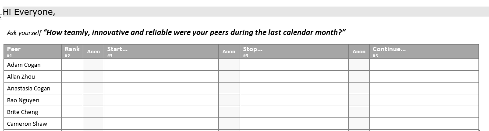

Encouraging your team to evaluate their peers is a proven method to improve working environment and productivity.  

<!--endintro-->

All peers that worked together should evaluate each other by filling a Peer Evaluation Email every month.

The evaluation is done by giving constructive comments in “Start, Stop, Continue”
 e.g. (Start...) checking in with better comments  
 e.g. (Stop...) coding without a user story   
 e.g. (Continue...) with your helpful SEO comments

