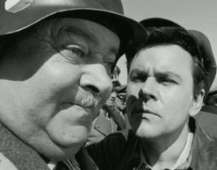

Any time you come to some verbal arrangement with an employee, client or contractor, which creates or varies a contract (for example changes to rates, deliverables etc.​), it's crucial you draft the agreement yourself. 
 
 <excerpt class='endintro'></excerpt> 

   Figure: Can you really trust the other side to draft the agreement correctly?

Sometimes, especially if you are an efficient manager and enjoy delegating, it's tempting to ask the other party to write up the change. This is a major risk:

<ol>
    <li>The other party may not even get around to drafting the agreement leaving you without a paper trail </li>
    <li>If they do draft the agreement it may not accurately reflect the conversation </li>
</ol>

Take responsibility for any agreements you make. Draft them yourself and then send an email <a shape="rect" href="/_layouts/15/FIXUPREDIRECT.ASPX?WebId=3dfc0e07-e23a-4cbb-aac2-e778b71166a2&TermSetId=07da3ddf-0924-4cd2-a6d4-a4809ae20160&TermId=2b86d144-7041-41f3-92aa-d7d59b88149a">"as per our conversation"</a>.

<strong></strong>

