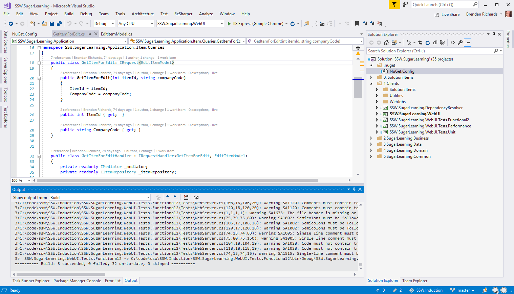
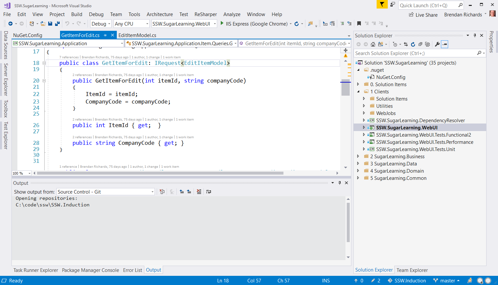
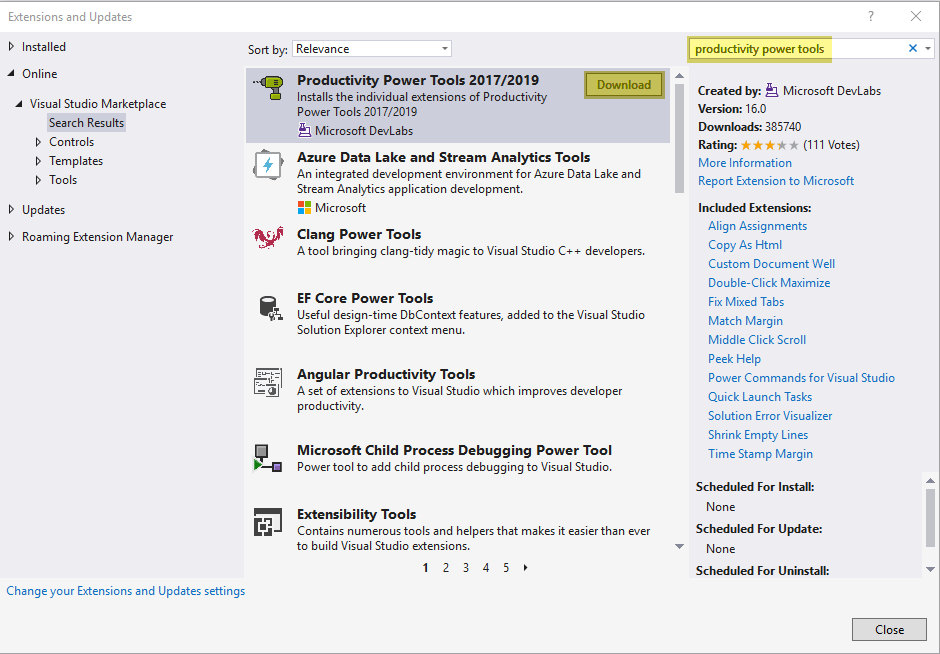
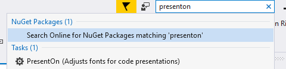
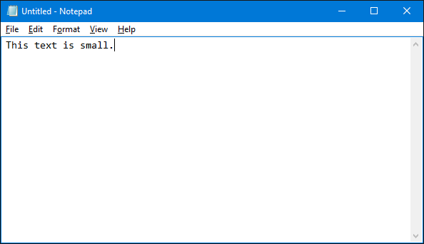
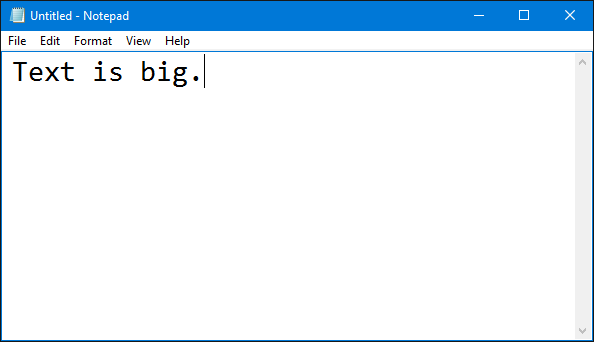
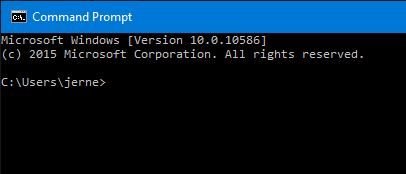
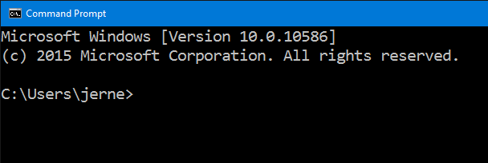

When presenting to an audience using visual studio it is important to alter a few things for the best possible experience for the audience.

<!--endintro-->

First of all, you need to make your font bigger. This is probably rule number one. There's nothing worse than not being able to see the excellent code you're trying to demo.

Secondly, you need to remove any distracting panes or other windows. These usually just get in the way. If you really need them, make sure they're set to pin mode, so they hide themselves when not in use.

Most importantly, you can have all these things done for you in the click of a button by using the presenter mode extension. It automatically sets the correct font and removes distracting windows.

### Visual Studio
<dl class="badImage">&lt;dt&gt;   &lt;/dt&gt;<dd>Figure: Bad Example - Code is small and most of the Visual Studio UI is too small to read </dd></dl><dl class="goodImage">&lt;dt&gt;   &lt;/dt&gt;<dd>Figure: Good Example - Code is much more readable and Visual Studio UI is large enough to read </dd></dl>
 **

** 

 **Figure: you can install Productivity Power Tools via Extensions and Updates. This includes the presentOn feature.** 

<dl class="image">&lt;dt&gt;   &lt;/dt&gt;<dd>Figure: Use quick launch for toggling between presentOn and presentOff. </dd></dl>
Thanks to [Nathan Totten](https://ntotten.com/2012/12/12/visual-studio-2012-presentation-mode/) for showing us this tip back in 2012.

### Text Editor

Change font size in your text editor.
<dl class="badImage">&lt;dt&gt;  &lt;/dt&gt;<dd>Figure: Small font size </dd></dl><dl class="goodImage">&lt;dt&gt;  &lt;/dt&gt;<dd>Figure: Good font size </dd></dl>
### Command Prompt

And don't forget to change your command prompt as well.
<dl class="badImage">&lt;dt&gt;  &lt;/dt&gt;<dd> Figure: Command prompts are hard to read </dd></dl><dl class="goodImage">&lt;dt&gt;  &lt;/dt&gt;<dd>Figure: Font size for command prompt should be about twice as much as by default</dd></dl>
