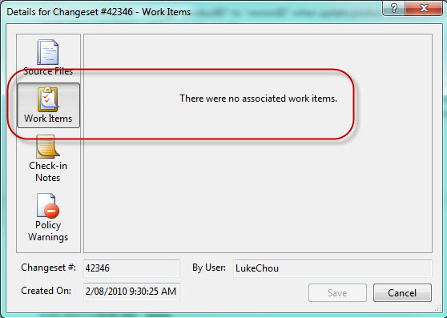
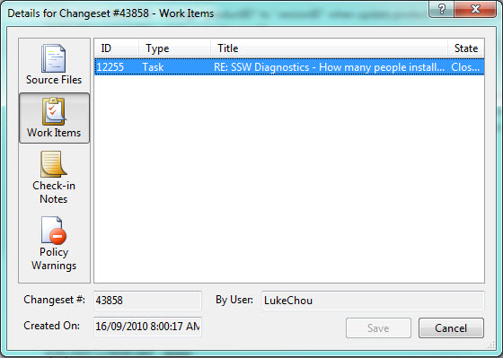
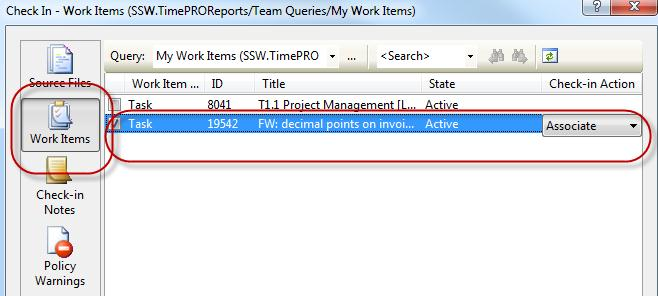
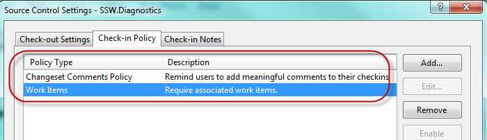

One of the big advantage of using TFS is end to end traceability, however this requires the developer to do one extra step to link their code (changeset) with requirements (work items). Code is the body of software, while user requirement is the spirit. Work Item association feature helps us to link the spirit and body of software together. This is especially useful when you trying to identify the impact of a bug in term of user requirements.

<!--endintro-->
<dl>&lt;dt&gt;&lt;/dt&gt;
<dd>Figure: Bad Example: No work item is associated with changeset </dd></dl><dl>&lt;dt&gt;&lt;/dt&gt;
<dd>Figure: Good Example: No work item is associated with changeset </dd></dl>
More Information 
In order to achieve this, developers need to choose the Work Item tab when check-in and "associate" code with a related work item.
<dl>&lt;dt&gt;&lt;/dt&gt;
<dd>Figure: Associate Work Item with Changeset </dd></dl>
As the project administrator, you can take one step further to enable "Work Item Check-in Policy" to enforce this rule in your team.
<dl>&lt;dt&gt;&lt;/dt&gt;
<dd>Figure: Always enable the “Work Items check-in policy”</dd></dl>
