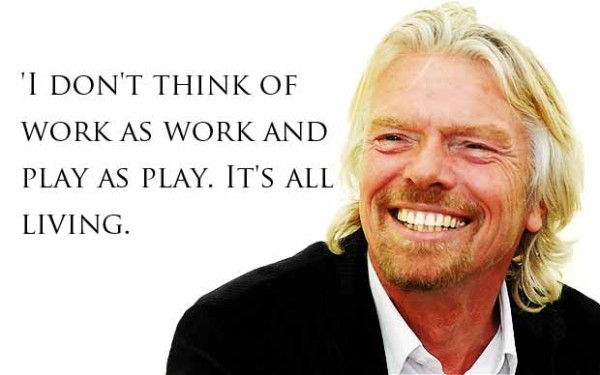

Long-term success in a career necessitates wholeheartedly embracing and enjoying your job, fulfilling your responsibilities, continuously enhancing your company, and consistently striving for personal growth and improvement.

If you find yourself not enjoying your job, this is not necessarily a bad thing. You should make a commitment to give it a go and try to make it work. When you have decided you are unhappy, you should talk to your boss and figure out what is making you unhappy.

<!--endintro-->

Ensuring job satisfaction and enjoyment can be influenced by various factors. Here are some strategies to help cultivate a positive work experience:

* **Find Meaning and Purpose** - Seek roles and tasks that align with your passions, interests, and values. When your work has a greater purpose or meaning to you, it becomes more fulfilling and enjoyable.

* **Cultivate Positive Relationships** - Foster positive connections with colleagues and build a supportive network. Collaborating with like-minded individuals, having open communication, and engaging in team activities can contribute to a more enjoyable work environment.

* **Seek Growth and Development** - Look for opportunities to learn and grow professionally. This can include attending training sessions, pursuing certifications or further education, and taking on new challenges. Continuous development keeps work fresh and stimulating.

* **Maintain Work-Life Balance** - Strive for a healthy balance between work and personal life. Prioritize self-care, set boundaries, and [engage in activities outside of work](/employee-yolo-day) that bring you joy and fulfillment. Balancing responsibilities can enhance overall job satisfaction.

* **Celebrate Achievements** - Recognize and celebrate your accomplishments, both big and small. Acknowledging your successes boosts morale and instills a sense of pride in your work, enhancing enjoyment and motivation.

* **Communicate and [Provide Feedback](/rules-to-better-giving-and-taking-feedback)** - Openly communicate with your supervisors and team members. Share your ideas, concerns, and suggestions for improvement. Engaging in constructive feedback and dialogue fosters a positive work environment and a sense of empowerment.

* **Seek Support and [Mentorship](/mentoring-programs)** - Connect with mentors or seek guidance from experienced colleagues. Having someone to provide support, advice, and mentorship can enhance your enjoyment and growth within your job.

Remember, enjoying your job is a dynamic process that requires effort and self-awareness. By proactively engaging in these strategies, you can foster a more fulfilling and enjoyable work experience.

::: greybox
**Tip for Software Consultants:** The number 1 cause of stress in this industry is caused by running out of budget for a project. The best way to handle this is to give realistic estimates, and inform the clients as soon as it looks like they will be exceeded. A client who has accepted the realities of his project is less scary than working on code that's already over-budget with an impending unknown client reaction.
:::

