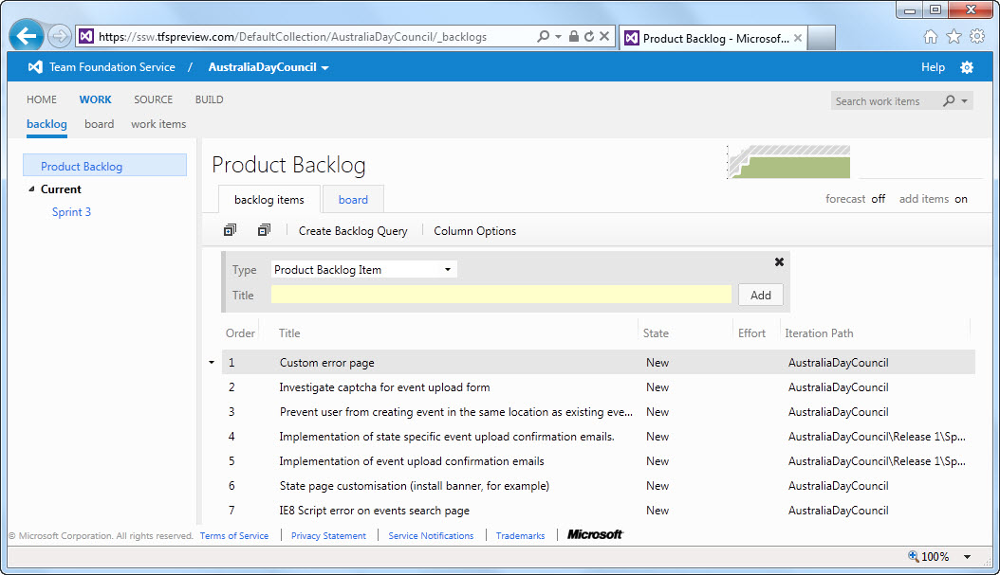
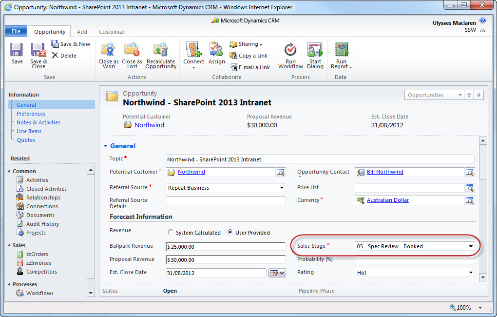

So you had a good initial meeting (like a 1st coffee with a new girl), and you have agreed to have a Specification Review (aka first date).

For the majority of new clients, a [Specification Review](/conduct-a-spec-review) (also known as a Spec Review) will be your 1st paid engagement with them, and gives the client a [smaller first commitment](/do-you-aim-for-an-advancement-rather-than-a-continuance). This is to work out the requirements and put together a broad time and cost estimate.

It is a simple 4 step process:

<!--endintro-->

1. Once you have decided that this is a project you want to work on, you have to convince the client to book in a Spec Review
    * This is a 1-5 day exercise for 1-2 people. The general rule is 1 man day per expected 2-week Sprint.
    * This process is timeboxed, and so appears to the client as a fixed price.
2. Make sure you get [Terms and Conditions](http://www.ssw.com.au/ssw/standards/forms/ConsultingOrderTermsConditions.aspx) signed before you start work on this.
3. **Specification Review** - You will create a backlog of tasks, and some form of document (word or ppt) to present to the client explaining your proposed approach.

  

4. Present the Spec Review results to the client (in a meeting with all stakeholders) on site if possible, or over the phone if not, but never just by email.

::: good  
  
:::

::: good  
  
:::
