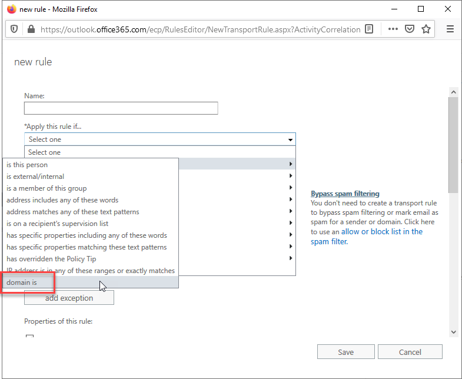

Zendesk is being used everywhere now, and it is good! To ensure you are receiving important internal tickets, you need to whitelist your Zendesk domain in your primary email server.

<!--endintro-->

If you are using Exchange, you can do this by doing the following:

1. Go to your Exchange Admin Center (if Office 365, https://outlook.office365.com/ecp/);
2. Mail Flow | + icon | Bypass spam filtering:
<dl class="image">&lt;dt&gt;&lt;/dt&gt;<dd>Figure: Bypass spam filtering setting in Exchange</dd></dl>
3. On the new window that opens, type a good name for the rule | Apply this rule if... | domain is | type your Zendesk domain (in our case, ssw.zendesk.com):
<dl class="image">&lt;dt&gt;&lt;/dt&gt;<dd>Figure: Adding domain to bypass list </dd></dl>
4. The rest should already be correctly configured, hit Save

Done! You now allow any Zendesk emails through your server correctly. No more missing important tickets!"
