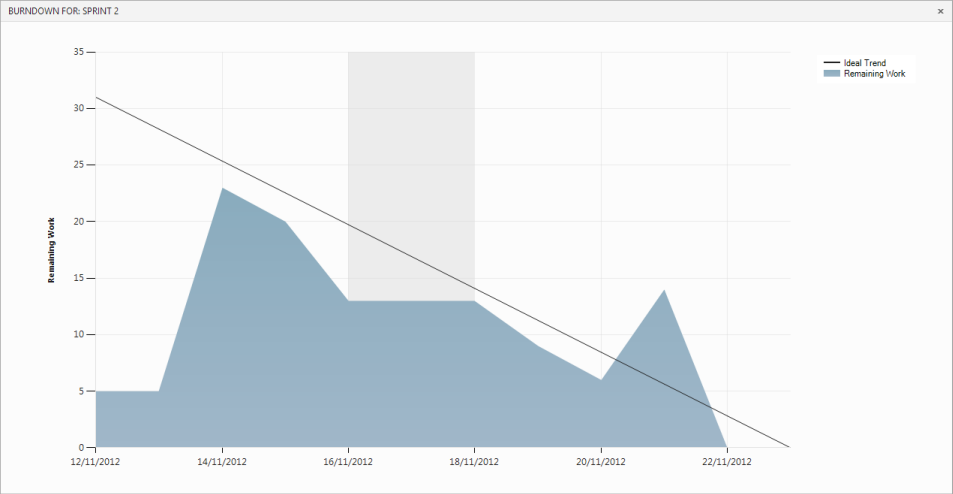
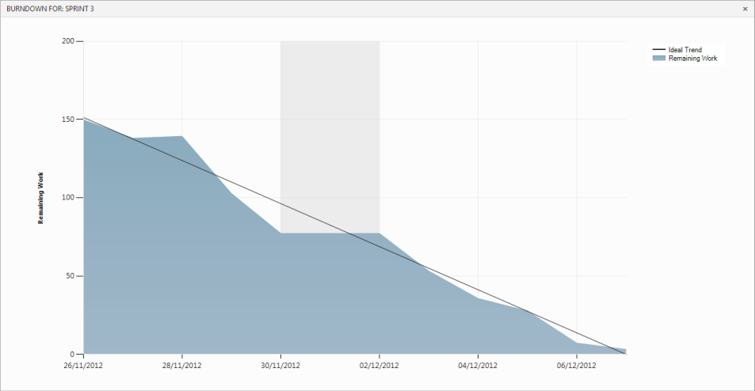

In Scrum, it's important to flesh out the details of a PBI when it makes sense to do so.

You should estimate your PBIs as soon as you can, but you don't need to break all of your PBIs down into fully-estimated tasks as soon as they're added to the backlog.

However, before starting work on a sprint you should always break the PBIs in that sprint into estimated tasks.

<!--endintro-->

Team Foundation Server uses the remaining hours assigned to Tasks to calculate the burndown.  By breaking the PBIs down into tasks with estimates, your burndown will start looking correct right from the first day of the sprint.

::: bad
Figure: Bad Example - The tasks weren't estimated at the start of the sprint
:::

::: good
Figure: Good Example - The tasks were estimated from day one
:::
