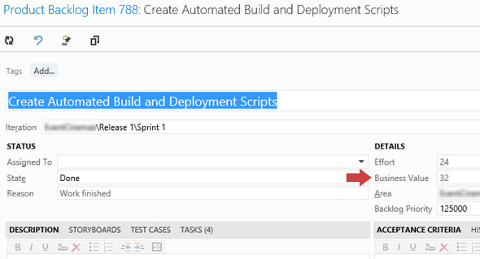

OK you say you do Scrum, but do you use the "Business Value" field?

That's OK, most teams don't... but it is a terrible shame, because developers go to the trouble of estimating 'Effort' and if you have Effort, all you need is Business Value and you can calculate ROI.

Once you have ROI a Product Owner can use the ROI field to sort priority. Awesome.

<!--endintro-->

ROI (Return on Investment) is an unbelievably simply calculation.
<dl class="image">&lt;dt&gt;
       
   &lt;/dt&gt;<dd>Figure: Product Owners should be estimating the Business Value</dd></dl>

::: greybox
ROI = Business Value / Effort
:::

...of course there are other factors to consider.

E.g. Risk, Dependencies etc and you could make the formula more complicated....

::: greybox
Priority = (Positive Value - Negative Value) + Risk + Dependencies / Effort
:::

...but don't bother.

The product backlog is just a list of items with rough estimates of both development 'Effort' and 'Business Value'. You will find that ROI will tell you great stuff. It is especially useful for finding the easy high value items to kick off a sprint.

### Product Owners are too busy for this

If it is good enough for developers to estimate story points... then it is good enough for the Business to estimate Business Value. Usually devs will use the Fibonacci sequence, but since it is a good idea that the business guys use the same scale, it is best to switch to the doubling method of estimating -     [Do you know how to size user stories effectively?](/Pages/Do-You-Know-How-To-Size-Stories-Effectively.aspx)

For example, if the "add rich text box" and "add sortable column headings on the grid" have the same business value of 3, the one with the smallest development effort will have higher priority (the ROI is greater).

In summary, the simple calculated field ROI, can automatically order the backlog tasks for the Product Owner, makes estimating Business Value just good sense.

### Related links

* [Adam's blog - Effective Product Owners use the "Business Value" Field](http://www.adamcogan.com/2013/05/08/the-business-value-field/)
* [SSW TV - Estimating "Business Value" to order your Backlog](http://tv.ssw.com/3102/business-value)
