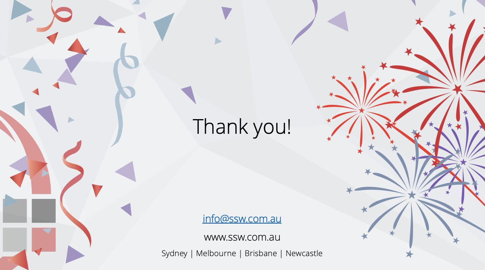

Always end your presentation with a 'Thank You' slide. More than being polite, it makes clear that this is the last slide and presentation is over. You can also take the opportunity to inform the audience of your contact details.

Even better; if you did a good job, you might get a clap (or in Adam's case, a cough).

<!--endintro-->

