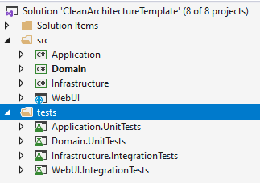

<h3 class="ssw15-rteElement-H3">Test Projects​​ </h3>
Tests typically live in separate projects – and you usually create a project from a template for your chosen test framework. Because your test projects are startup projects (in that they can be independently started), they should target specific .NET runtimes and not just .NET Standard. A unit test project usually targets a single code project.
<h3 class="ssw15-rteElement-H3">Project Naming​ </h3>
Integration and unit tests should be kept separate and should be named to clearly distinguish the two. This is to make it easier to run only unit tests on your build server (and this should be possible as unit tests should have no external dependencies)  Integration tests require dependencies and often won't run as part of your build process.  These should be automated later in the DevOps pipeline. 

 <excerpt class='endintro'></excerpt> 
<h3 class="ssw15-rteElement-H3">​Test Project Location​ </h3>
Test projects can be located either: 
<ul><li>Directly next to the project under test – which makes them easy to find, or </li><li>In a separate tests location – which makes it easier to deploy the application without tests included. </li></ul><dl class="badImage"><dt>
      
   </dt><dd>Figure: In the above project, the tests are clearly placed in a separate location which makes it easy to deploy to production without them. It’s easy to tell which project is under test and what style of tests will be found in each test project. 
      <a href="https://github.com/jasontaylordev/CleanArchitecture">https://github.com/jasontaylordev/CleanArchitecture​</a></dd></dl><h3 class="ssw15-rteElement-H3">​Naming Conventions for Tests​​ </h3>There are a few “schools of thought” when it comes to naming the tests themselves.  Internal consistency within a project is important. It’s usually a bad idea to name tests after the class or method under test – as this naming can quickly get out-of-sync if you use refactoring tools – and one of the key benefits from unit testing is the confidence to refactor!   Remember that descriptive names are useful – but the choice of name is not the developer’s only opportunity to create readable tests. 
<ul><li>Write tests that are easy to read by following the three A's (Arrange, Act, and Assert) </li><li>Use a good assertion library to make test failures informative (e.g. <a href="https://github.com/shouldly/shouldly">Shouldly</a> or <a href="https://fluentassertions.com/">FluentAssertions</a>) </li><li>Use comments and refer to bug reports to document the “why” when you have a test for a specific edge-case. </li><li>Remember that the F12 shortcut will navigate from the body of your test straight to the method you’re calling.</li><li>The point of a naming convention is to make code more readable, not less - so use your judgement and call in others to verify your readability. </li></ul><dl class="badImage"><dt>​</dt><dd>Figure: Bad Example - From the test explorer view you cannot tell what a test is meant to test from the name</dd></dl>
 
   <b>[Method/PropertyName]_Should_[ExpectedBehavior]_When_[StateUnderTest]</b>
<dd class="ssw15-rteElement-FigureNormal">Figure: The "should" naming convention is effective – it encourages developers to clearly define the expected result upfront without requiring too much verbosity.</dd>  The following test names use the "should" naming convention:  

<b>Withdraw_Should_ThrowException_When_InvalidAccountInfo</b>  <strong>Checkout_Should_Add10Precent_When_CountryIsAustralia</strong>  <b>Purchase_Should_Suceed_When_BalanceIsWithinCreditLimit</b> 
<dd class="ssw15-rteElement-FigureGood">Figure: Good Examples - Without looking at code, I know what the unit tests are trying to do </dd>
A list of other suggested conventions can be found here: <a href="https://dzone.com/articles/7-popular-unit-test-naming">7 Popular Unit Test Naming Conventions</a>.

