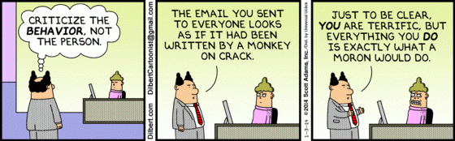

The sandwich rule approach is an effective way to provide feedback to other team                     members and clients.

<!--endintro-->

1. Start with positive feedback
2. Give your recommendations for improvement
3. End with some additional positive feedback (you may repeat #1)

This optimistic approach allows you to maintain a healthy relationship with your team members and clients.

::: bad

:::
