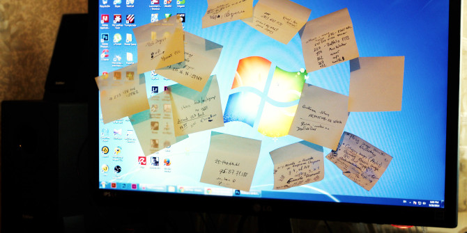
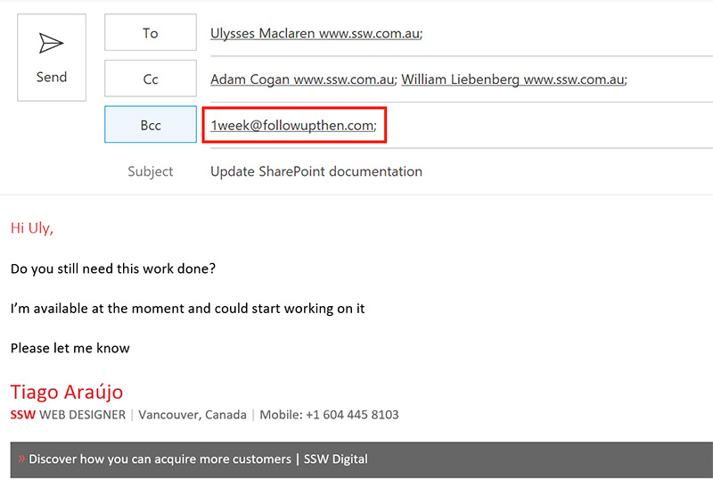

Sometimes you're not able to complete a task right away or anytime soon. In this case, people usually just say:

::: greybox
"I can't do this week, but I should have it done by the end of next week"
:::

Another scenario is when the task should be done or will expire after a period of time. For example:

::: greybox
"Send Google Analytics data after a month" or "Remove course banner after the course is completed"
:::

Efficient people don't rely on their memory and instead, use some way to make sure they don't forget to do that task. The most common ways are to either make a note in a paper diary, stick a post-it note to his screen. But there are better ways.

<!--endintro-->

::: bad  
  
:::

To ensure you follow up any task like these, there are two ways to set yourself a task to follow up in the future:

### #1 Email reminders - followupthen.com (recommended)
   
There is a brilliant service called FollowUpThen which can do all the administrative work for you.

Simply BCC or email **&lt;period of time&gt;@followupthen.com** and it will send you an email when that time expires, reminding you to follow up with another email.

::: good  
  
:::

Note that you are sending this email thread to a 3rd party, so if you're dealing with any confidential information, strip it out before using this tool.

### #2 Delayed Email 

Write yourself an email in Outlook.     
Before pressing send, click **Options** | **Delay Delivery** , and then specify when you want to be reminded.

The email will sit in your outbox until the required time, when it will be sent to whoever you specified (you in this case)
When you receive it in your inbox, action the task.

::: good  
  
:::

### #3 Follow Up flag feature in Outlook

When you require a reminder to follow up on an email by a certain date:

1. Click the Follow Up button 
      
  

2. Select an appropriate date from the drop-down or choose Custom to add additional reminders 
         
  

You can even set a custom reminder for the recipient :)

3. Outlook shows an info tip with the exact follow-up date you chose

4. A To-Do item is also added to your Outlook To-Do list 
      
  

**Note:** To-Do list can be found in the Tasks pane

5. On the due date you will receive a Reminder popup from Outlook

6. If you chose to add a custom reminder you will also receive a Reminder popup from Outlook
