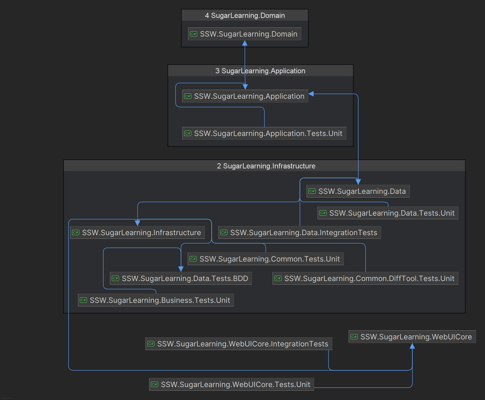
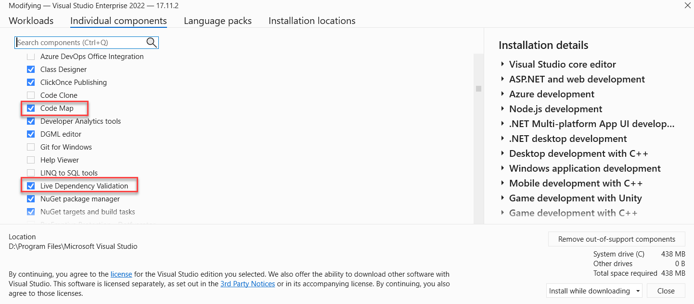
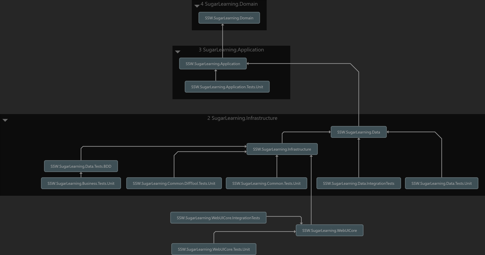
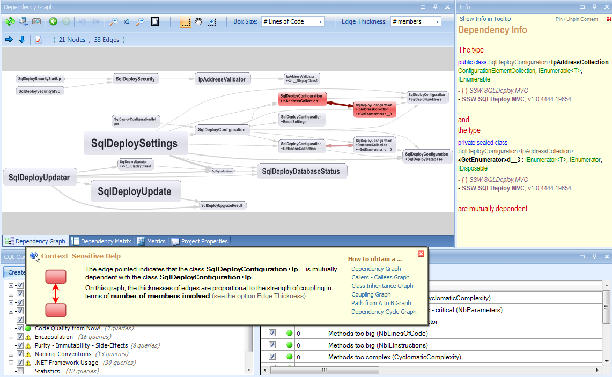

Dependency graphs are important because they give you an indication of the coupling between the different components within your application.

A well architected application (ie. one that correctly follows the Onion Architecture) will be easy to maintain because it is loosely coupled.

<!--endintro-->

There are many tools to generate dependency graphs for your .NET projects. Each tool has its own pros and cons. Lets dive in into dependency graphs generated by different tools and look at their advantages and disadvantages.

### Option 1 - Rider

Generating the dependency graph is easy with the Rider's built-in tool. Check the official [docs](https://www.jetbrains.com/help/rider/Architecture__Project_Dependencies_Exploration.html) for more information about dependency graphs in Rider.

### ✅ Pros

* **Dependency view** - The graph is readable and organized
* **Dependency cycle** - Enables users to find dependency problems in the project
* **Generation time** - The dependency graph generation is very fast
* **Customizability** - It has useful menu to select or deselect any project from the graph
* **Availability** - You don't require to install any extension into Rider or select any component when you are installing Rider, it is already available in the IDE

### ❌ Cons

* **Cost** - After one-month trial, you will need a license to continue using Rider
* **Cluttered view** - Complex projects require manual layout adjustments to make the graph readable (no advanced layout tools like Visual Studio has)
* **Layout** - Only Top to Bottom layout

::: good  
  
:::

### Option 2 - Visual Studio Enterprise

To generate the dependency graph with Visual Studio, first you need to check if you have installed **Code Map** and **Live Dependency Validation** components. Check official [docs](https://learn.microsoft.com/en-us/visualstudio/modeling/install-architecture-tools?view=vs-2022) to learn more about architecture tools in Visual Studio.

### ✅ Pros

* **Dependency view** - Provides high-level view of project dependencies
* **Dependency cycle** - Enables users to find dependency problems in the project
* **Layout** - Visual Studio gives different layout options, e.g. Top to Bottom, Quick Clusters, Left to Right, etc.
* **Availabilty of graph for everyone** - Any Visual Studio edition can read already generated dependency graphs

### ❌ Cons

* **Interface** - Interacting with the graph is slow and not fluid
* **Cluttered view** - Graph becomes unreadable and confusing for complex projects
* **Enterprise edition** - Only Visual Studio Enterprise can generate the dependency graph, see official [docs](https://learn.microsoft.com/en-us/visualstudio/modeling/analyze-and-model-your-architecture?view=vs-2022#VersionSupport) for version support

::: good  
  
:::

### Option 3 - Visual Studio + ReSharper

The other option to generate dependency graph is by installing ReSharper extension in Visual Studio.
Check the official [docs](https://www.jetbrains.com/resharper/) about installing ReSharper.

### ✅ Pros

* **Dependency view** - The graph is readable and organized
* **Dependency cycle** - Enables users to find dependency problems in the project
* **Interface** - The interaction with the graph feels very smoothly
* **Customizability** - It has useful menu to select or deselect any project from the graph (same with Rider)

### ❌ Cons

* **Requires ReSharper** - Need to install a third-party ReSharper extension in Visual Studio
* **Performance impact** - Some slowdown can be noticed when ReSharper is enabled
* **Additional cost** - After one-month trial, you will need a license to continue using ReSharper
* **Preferred tool** - Use Rider instead of Visual Studio + ReSharper
* **Cluttered view** - Complex projects require manual layout adjustments to make the graph readable (no advanced layout tools like Visual Studio has)
* **Layout** - Only Top to Bottom layout

::: ok  
  
:::

When project is complex and large, the graphs generated by these tools can be messy and hard to read. In that case you can try nDepend 3rd party solution with the Visual Studio to generate the graph.

Read more about nDepend: [ndepend.com](http://www.ndepend.com/)

#### Further Reading

* [Do you use a dependency injection centric architecture?](/do-you-use-a-dependency-injection-centric-architecture)
* [Do you know the best dependency injection container?](/the-best-dependency-injection-container)
