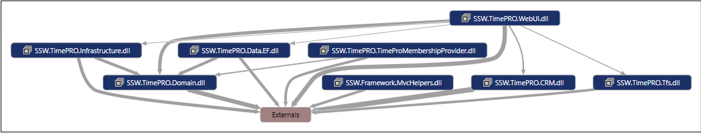
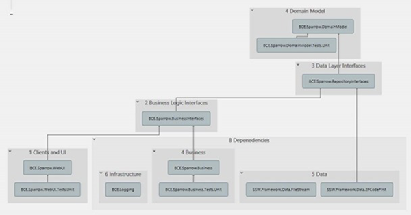

Dependency graphs are important because they give you an indication of the coupling between the different components within your application.

A well architected application (ie. one that correctly follows the Onion Architecture) will be easy to maintain because it is loosely coupled.

<!--endintro-->

::: bad  
  
:::

::: good  
  
:::

#### Further Reading:

* [Do you use a dependency injection centric architecture?](/do-you-use-a-dependency-injection-centric-architecture)
* [Do you know the best dependency injection container?](/the-best-dependency-injection-container)
