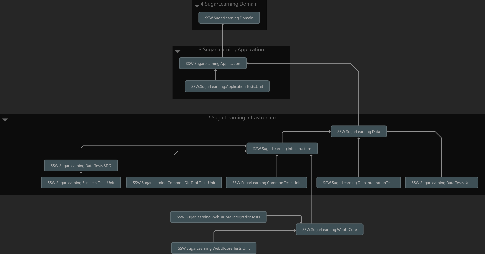

Dependency graphs are important because they give you an indication of the coupling between the different components within your application.

A well architected application (ie. one that correctly follows the Onion Architecture) will be easy to maintain because it is loosely coupled.

<!--endintro-->

There are many tools to generate dependency graphs for your .NET projects. Each tool has its own pros and cons. Lets dive in into dependency graphs generated by different tools and look at their advantages and disadvantages.

### Option 1 - Rider

Generating dependency graph is easy with the Rider's built-in tool. Check the official [docs](https://www.jetbrains.com/help/rider/Architecture__Project_Dependencies_Exploration.html) for more information about dependency graphs in Rider.

### ✅ Pros

* **Dependency view** - The graph is readable and organized
* **Dependency cycle** - It is easy to find the dependency issue of the project
* **Generation time** - The dependency graph generation is very fast
* **Interface** - The interaction with the graph feels very smoothly
* **Customizability** - It has beautiful menu in the left to select or deselect any project from the graph
* **Availability** - You don't require to install any extension into Rider or select any component when you are installing Rider, it is already available in the IDE

### ❌ Cons

* **Cost** - After 1 month trial, you will need license to continue using Rider
* **Cluttered view** - Complex projects require manual layout adjustments to make the graph readable (no advanced layout tools like Visual Studio has)
* **Layout** - Only Top to Bottom layout

::: good  
  
:::

### Option 2 - Visual Studio Enterprise

To generate dependency graph with Visual Studio, first you need to check if you have installed **Code Map** and **Live Dependency Validation** components. Check official [docs](https://learn.microsoft.com/en-us/visualstudio/modeling/install-architecture-tools?view=vs-2022) to learn more about architecture tools in Visual Studio.

### ✅ Pros

* **Dependency view** - Provides high-level view of project dependencies
* **Layout** - Visual Studio gives different layout options, e.g. Top to Bottom, Quick Clusters, Left to Right, etc.
* **Availabilty of graph for everyone** - Any Visual Studio edition can read already generated dependency graphs

### ❌ Cons

* **Dependency cycle** - It is hard to track the dependencies and find the issues of the project, needs manual customization to the graph nodes to make it more readable
* **Interface** - Interacting with the graph is slow and not fluid
* **Cluttered view** - Graph becomes unreadable and confusing for complex projects
* **Enterprise edition** - Only Visual Studio Enterprise can generate the dependency graph, see official [docs](https://learn.microsoft.com/en-us/visualstudio/modeling/analyze-and-model-your-architecture?view=vs-2022#VersionSupport) for version support

::: good  
  
:::

### Option 3 - Visual Studio + ReSharper

The other option to generate dependency graph is by installing ReSharper extension for Visual Studio.
Check the official [docs](https://www.jetbrains.com/resharper/) about installing ReSharper in Visual Studio.

### ✅ Pros

* **Dependency view** - The graph is readable and organized
* **Dependency cycle** - It is easy to find the dependency issue of the project
* **Generation time** - The dependency graph generation is fast
* **Interface** - The interaction with the graph feels very smoothly
* **Customizability** - It has beautiful menu in the left to select or deselect any project from the graph same with Rider

### ❌ Cons

* **Requires ReSharper** - Need to install a third-party ReSharper extension in Visual Studio
* **Performance impact** - Some slowdown can be noticed in Visual Studio with ReSharper
* **Additional cost** - After one-month trial, you will need a license to continue using ReSharper in Visual Studio
* **Preferred tool** - Use Rider instead of Visual Studio + ReSharper
* **Cluttered view** - Complex projects require manual layout adjustments to make the graph readable (no advanced layout tools like Visual Studio has)
* **Layout** - Only Top to Bottom layout

::: ok  
  
:::

#### Further Reading

* [Do you use a dependency injection centric architecture?](/do-you-use-a-dependency-injection-centric-architecture)
* [Do you know the best dependency injection container?](/the-best-dependency-injection-container)
