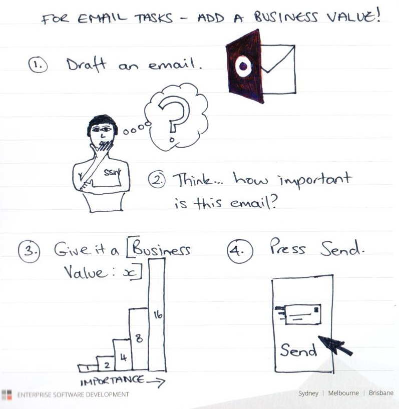
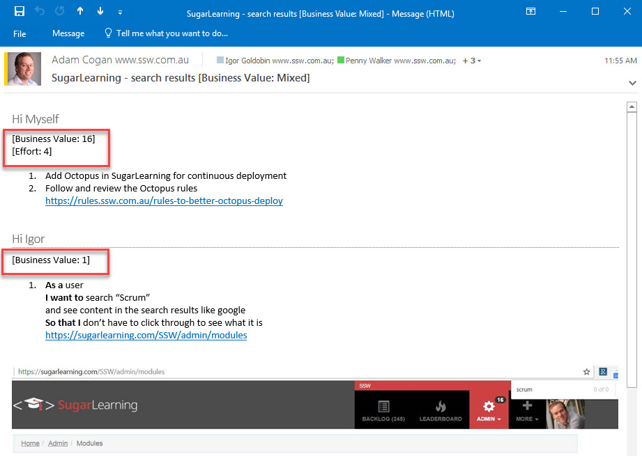

The problem with emailing a task, is that no one knows how important that email is, in relation to all their other emails. So, what is the solution?

<!--endintro-->

There are the 3 ways people can send tasks:

1. Send an email only.

::: bad
Figure: Bad example - An email with requirements does not indicate the priority  
:::

2. Put the task straight into the backlog, and send no email:

::: bad
Figure: Bad example - The developer does not get a chance to ask questions and refine it before it hits the backlog  
:::

3. Send an email, the recipient reviews it and places it into the backlog, based off the specified Business Value. Developers often prefer this method if they like control over their backlog.

::: good
Good example - Email tasks with a Business Value, allow the developer to review before putting it in the backlog

:::

### The perfect email workflow

Before you email a task to someone, think about how important it is to you.  Then draft your email, add the Business Value using the same scale that you would use to estimate your PBIs.

::: good
Figure: Good example - The best workflow for sending an email  
:::

**Q:** What if you need to write an email to multiple recipients?  
**A:** Assign each person a Business Value. In the case of "To Myself" emails, you can also add the amount of 'Effort' required too.

::: good
Figure: Good example - The best workflow for sending an email (with multiple recipients)

:::

Related links

* [Estimating - Do you know how to size user stories effectively?](/estimating-do-you-know-how-to-size-user-stories-effectively)
* [Do you estimate “Business Value”?](/do-you-estimate-business-value)
