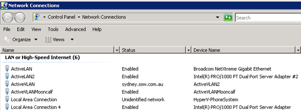
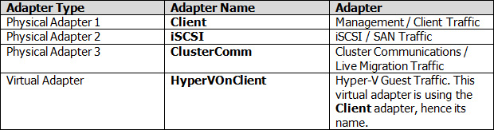

When you configure Hyper-V Clustering, each node will have upwards of 4 network adapters, some virtual and some physical. It is important to give these adapters meaningful names so you know what network adapter does what. 

<!--endintro-->

::: bad

:::

::: good

:::

::: good

:::
