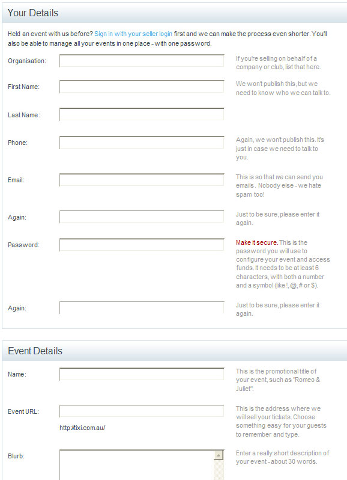
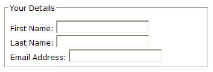

<strong>​FieldSet</strong> element allows you to group thematically related controls
                    and labels. Grouping controls makes forms more accessible and easier for users to
                    understand the purpose of filling the forms.

See the example below using "Your Details"
                    and "Event Details".

 <excerpt class='endintro'></excerpt> 
<dl class="goodImage"><dt> 
       
   </dt><dd>Figure: Good example - Use FieldSet for grouping</dd><dd></dd></dl>
Here's an example of how FieldSet works:
<dl class="code"><dt><pre><fieldset>
    <legend>Your Details</legend>
    

        <label for="FirstName">First Name: </label>
        <input id="FirstName" type="text" /> 
        <label for="LastName">Last Name: </label>
        <input id="LastName" type="text" /> 
        <label for="EmailAddress">Email Address: </label>
        <input id="EmailAddress" type="text" />
    

</fieldset></pre></dt><dd>Figure: Example code of FieldSet</dd></dl><dl class="image">​ 
   <dt> 
       
   </dt><dd>Figure: How that code will look on the browser</dd><dd></dd></dl>
​ Things to remember:
<ol><li>Wrap logical control groups in a <fieldset>.</li><li>The first child of a <fieldset> should be a <legend>, so the user knows what to expect in that section.</li></ol>​

