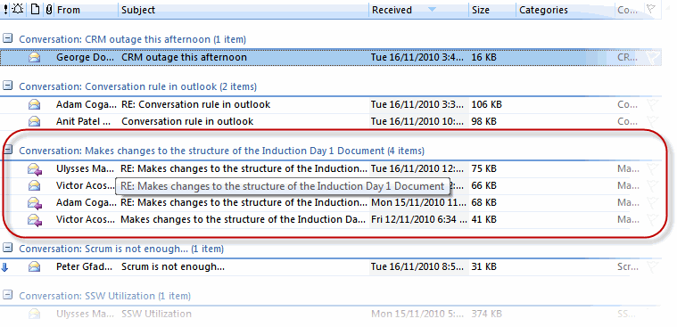
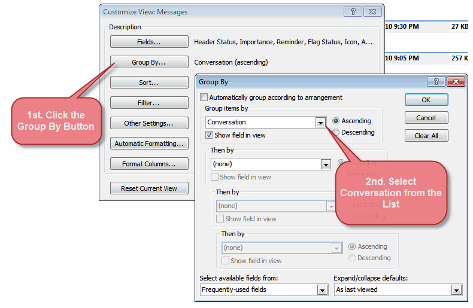

You may be involved in different tasks simultaneously every day.  The best way to organize your tasks and follow each task individually is grouping your emails by conversation.  By default, Outlook groups the emails by Date. 
 
 <excerpt class='endintro'></excerpt> 
<dl class="badImage"><dt></dt><dd>Figure: Bad example. Email messages are grouped by Date</dd></dl><dl class="goodImage"><dt></dt><dd>Figure:  Good example.  Email messages are grouped by Conversation</dd></dl>
Follow these steps to group by conversation:
<ol><li>Open Outlook and select the Mail View.</li><li>Right-click any column and choose the "Customize Current View..." option.</li><li>Select the "Group by..." option as displayed in the image.  
      <dl class="image"><dt></dt><dd>Figure:  Steps to group by conversation field </dd></dl></li><li>Select the "Conversation" field from the list.  (Leave empty the remaining groups)</li> 
</ol><strong>VIDEO</strong> - <a href="https://www.youtube.com/watch?v=LAqRokqq4jI">Top 10+ Rules to Better Email Communication with Ulysses Maclaren</a>  

