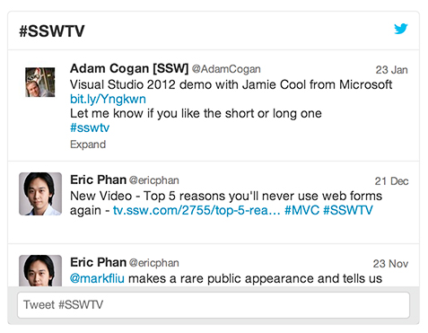
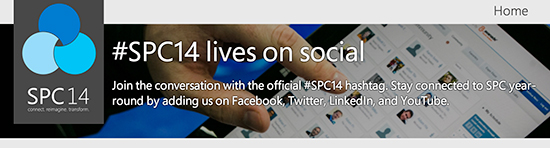

Twitter hashtags aggregate similar subjects on one page, so users can search for a particular trend, news, event, etc. 

It is a free tool that can be used in combination with other forms of promoting services, products and events. Create a short, consistent and easy to remember hashtag so people can find and talk about your business.

<!--endintro-->

You should have a banner that clearly show the hashtag people should use to refer to that specific subject.

See examples of pages that advertise their hashtags:

* [SSW TV](http://tv.ssw.com/)  #SSWTV
* [Sydney .NET User Group](http://www.ssw.com.au/ssw/NETUG/Sydney.aspx)  #NETUG
* [SSW Rules](/) #SSWRules

<dl class="image">&lt;dt&gt;  &lt;/dt&gt;<dd>Figure: This Twitter widget shows the hashtags working</dd></dl><dl class="goodImage">&lt;dt&gt; &lt;/dt&gt;<dd>Figure: Good Example - SharePoint Conference 2014 banner to advertise the hashtag people should use</dd></dl>
