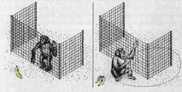
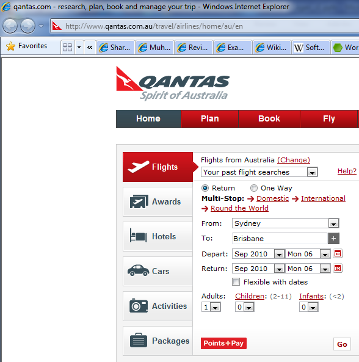

If you want users to take action on the web page content, add a "banana" - something that makes it obvious what the user is supposed to do.

For example, if your page is selling software, make it easy for your users to make a purchase. People don't have a lot of time to read your entire page and find the right link, so it is important to grab their attention by using a "banana".​​

 <excerpt class='endintro'></excerpt> 
<h4>Why do we call it "banana rule"?</h4>

                    How would you get a monkey pay attention to something? You could lure him by tempting
                    him with a banana. Once we have the monkeys attention focused on the banana, he
                    will try to get his hands on it regardless of the barriers on his way.
<dl class="image"><dt></dt><dd>Figure: If the monkey can see the banana, he will do whatever it takes to get it</dd></dl>
This is how the "banana rule" should be applied:
<dl class="badImage"><dt></dt><dd>Figure: Bad Example – "Points+Pay"button takes the attention over "Go"​ which should be the "banana"</dd></dl>So, remember most pages need a "banana" to get them to where you want them. "Bananas" are big, simple and stand out from the rest of the page<dl class="goodImage"><dt></dt><dd>Figure: Great Example - Team Viewer also has a good banana</dd></dl>

