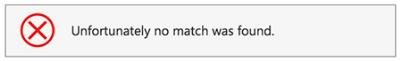

When a user looks at a search result, they expect to see a list of items to look into. If there are no results, don't give them noisy text because it can be taken as a search result. An icon also can be understood as a broken page. Your "no results" page should be clean.

<!--endintro-->
<dl class="badImage">&lt;dt&gt; 
       
   &lt;/dt&gt;<dd>Figure: Bad example - The list of "suggestions" is just noise and can confuse the user</dd></dl><dl class="badImage">&lt;dt&gt;
      
   &lt;/dt&gt;<dd>Figure: Bad example - Having an icon implies that an error happened which is not the case</dd></dl><dl class="goodImage">&lt;dt&gt; 
       
   &lt;/dt&gt;<dd>Figure: Good example - Plain and clean screen</dd></dl><dl class="goodImage">&lt;dt&gt; 
       
   &lt;/dt&gt;<dd>Figure: Good example - Plain and clean screen on mobile</dd></dl>
**Note:** In case the message you're showing is a "pass" or "fail, it is recommended to use an icon as per [Do you use icons to enforce the text meaning?](/_layouts/15/FIXUPREDIRECT.ASPX?WebId=3dfc0e07-e23a-4cbb-aac2-e778b71166a2&TermSetId=07da3ddf-0924-4cd2-a6d4-a4809ae20160&TermId=f91fb66f-5a63-4404-a01d-06222a172e03)
