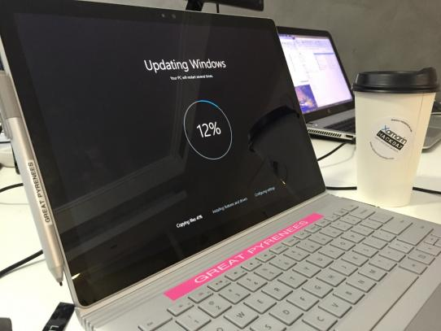

When we configure networks we give all computers in the company a naming theme like Buildings, Cars, Countries, Colours, Fruits, or Vegetables.

<!--endintro-->

At SSW we have adopted the animal kingdom.
<dd class="ssw15-rteElement-FigureNormal"> Figure: We name the PCs and label them - this one is "Great Pyrenees" </dd>
While you are attaching the label, it is also a good idea to affix a business card to the underside of the computer. This way if you lose your machine, anyone who finds it can easily contact you.
