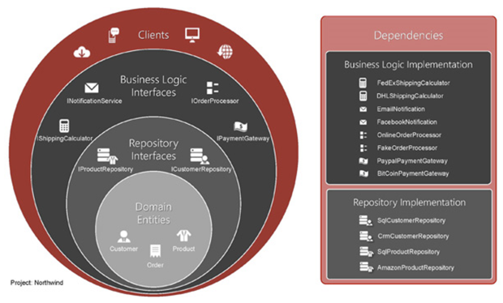
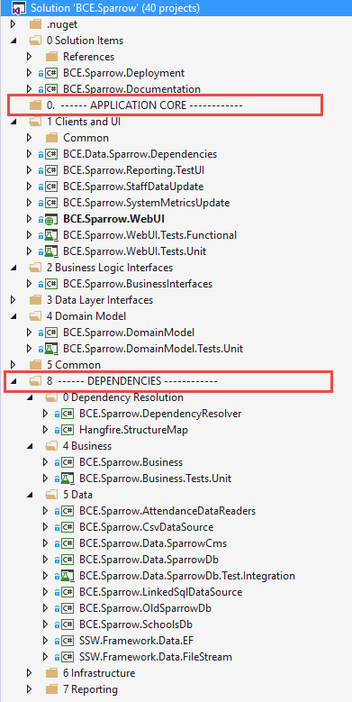

When developing software, we implement a [dependency injection centric architecture](/do-you-use-a-dependency-injection-centric-architecture).

<!--endintro-->

  

::: good  
  
:::

Dependencies and the application core are clearly separated as per the [Onion Architecture](/do-you-use-a-dependency-injection-centric-architecture).

In the above example you can clearly see:

* The different layers of the Onion Architecture - see [Layers of the Onion Architecture](/do-you-know-the-layers-of-the-onion-architecture)
* Unit test and integration test projects - see [Rules to Better Unit Tests](/rules-to-better-unit-tests)
* The Documentation solution folder - see [Do you review the documentation?](/do-you-review-the-documentation)
* The References solution folder - to hold any 3rd party assemblies that are not available via NuGet

Common Library projects are named **[Company].[AssemblyName]**.   
E.g. **BCE.Logging** is a shared project between all solutions at company BCE.

Other projects are named **[Company].[Solution Name].[AssemblyName]**.   
E.g. **BCE.Sparrow.Business** is the Business layer assembly for company ‘BCE’, solution ‘Sparrow’.

We have separated the unit tests, one for each project, for several reasons:

* It provides a clear separation of concerns and allows each component to be individually tested
* The different libraries can be used on other projects with confidence as there are a set of tests around them
