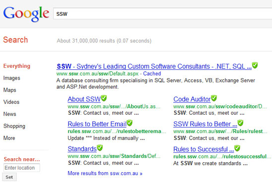
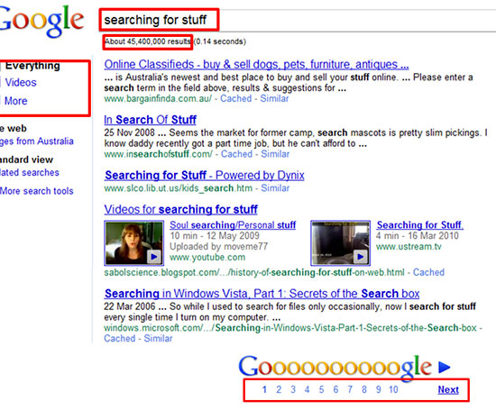

Every website out there has a page that displays the results of a search. No standard has been adopted throughout the web as nearly every site seems to have a different way of displaying data.

<!--endintro-->

However, Google is a very good example for displaying search results. Their result pages are clear and efficient, especially for a large result set.

::: good  
  
:::

So adopt Google's search result layout and it will give new and regular users a better navigation experience. Here's our standard layout for our search function.

Want the 'Google grid'? Then follow these rules to help users to navigate:

1. Filters at the top (if more than one search parameter,then add a "search" button)
2. The number of results found + how many seconds the search took to execute
3. A statement that explains the criteria that you used for searching (or keep the criteria in the text box like google does)
4. The number of pages found (hyperlinks centered in the middle), and these hyperlinks should be shown on the footer of the page only.

::: good  
  
:::

