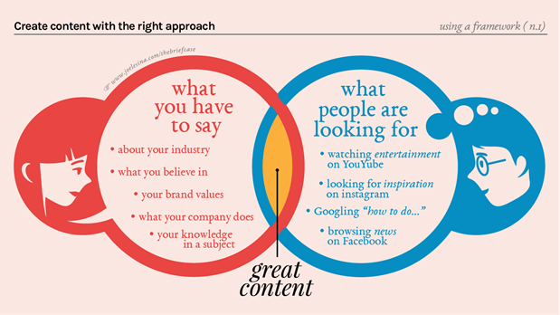

​Try googling content marketing. You’ll find lots of articles about it, and maybe some reports saying how this has been one of the main marketing strategies in the last 3 years. Content marketing is a strategic marketing approach focused on creating and distributing valuable, relevant, and consistent content to attract and retain a clearly-defined audience — and, of course, to drive profitable customer action. That’s why this is so important to be a part of your strategy. In other words: in order to sell the big piece of the pie, you have to show your audience small samples first. 
 
 <excerpt class='endintro'></excerpt> 

We are in a new era of content. Not just any content, but a well-crafted and relevant content for your target audience. To be able to find the right ​content for your followers, you have to plan, not just create randomly without a focus and without documenting your research.

When you follow a documented and organized content marketing strategy, you will:
<ul><li>Feel more effective in the use of all content marketing tactics and social media channels</li><li>Easily justify a higher budget to be spent on your content marketing (e.g. for recording a video or doing a partnership with an influencer )</li><li>Will be able to track results as soon as they have a clear goal and metric to follow, according to your strategy</li></ul>
It should definitely include:
<ul><li>Your audience personas </li><li>A content planner that matches these personas, channels, deadline and budget </li><li>Goals</li><li>Metrics that will be followed </li></ul><dl class="image"><dt></dt><dd>Figure: Marketing Content is valuable with the right approach! - Image source: 
      <a class="ignore" href="https://medium.com/%40joelesina/content-marketing-a-simple-guide-on-how-i-do-it-1b1791ca1898">Joe Lesina​</a></dd></dl>

