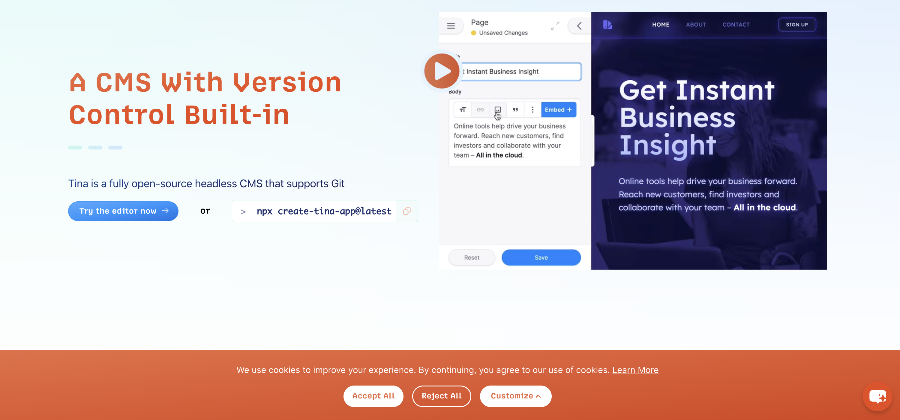
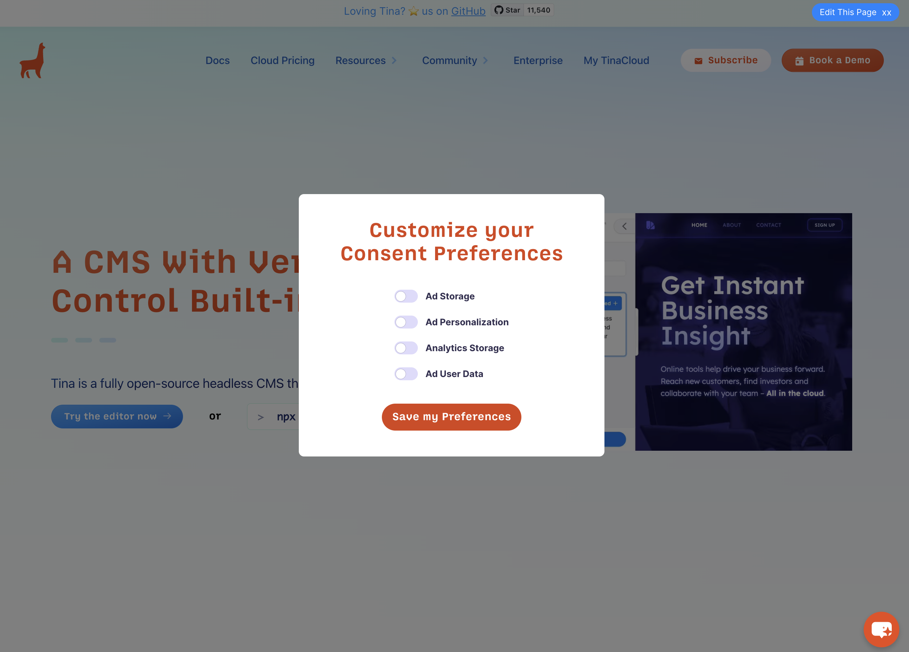
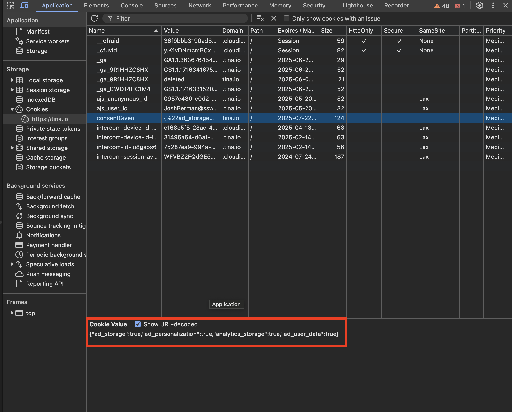

## The Problem

Now with this acquisition of Tina.io, we have more and more customers and traffic coming from Europe. However, the General Data Protection Regulation (GDPR) for Europe, has been [tightening cookie usage laws since 2018](https://gdpr.eu/cookies/). The GDPR mandates that websites obtain explicit consent from users before storing or retrieving any non-essential information on their devices, such as cookies used for tracking and personalization. This regulation aims to protect users' privacy and give them greater control over their personal data. By implementing a cookie consent banner, we ensure transparency and adhere to legal requirements, thereby fostering trust and safeguarding our users' rights.

## Do You Have a Cookie Consent Banner?

Creating a Cookie Consent Banner doesnt have to be tricky, it can be done simply in 3 steps.

* Cookie banner UI
* Creating and sending cookies
* Setting up GTM consent mode as per user preferences

## Cookie Banner UI

This section is very much customizable and will be different from site to site. Essentially we want to create some sort of pop-up, banner, or modal that will be prompted to users when visiting your site. On [Tina.io](https://tina.io) we opted for a banner along the bottom of the page.

The 3 button options should be
* ‘Accept All’ – users accepts all types of cookies
* ‘Reject All’ – users reject all cookies
* ‘Customize’ – According to GDRP we must allow users to manage their cookie preferences at any time. When users go to customize, all options must NOT be ticked.

On the Tina.io Site we let users customize their preferences with a modal.





## Creating and Sending Cookies

This section will actually send your cookie based on how users have interacted with your UI. We have used a nifty library called ‘js-cookie’ which provides a super easy way to transmit a cookie.

1. Install package and use on your component

```bash
npm install js-cookie
```

```js
import Cookies from 'js-cookie';
```

2. Create Cookie Variablr and Set
Example with a cookie that has all fields accepted, named 'consentGiven'

```js
    const acceptedConsent = {
      ad_storage: true,
      ad_personalization: true,
      analytics_storage: true,
      ad_user_data: true,
    };

    Cookies.set('consentGiven', JSON.stringify(acceptedConsent), {
      expires: 365,
    });
```

3. Confirm your cookie is being sent correctly

After interacting with the cookie banner, head to Developer Tools (F12) | Application | Cookies | Your Site

For example the Tina.io cookie



## Configuring Google Tag Manager

Now that you have successfully created, customized and transmitted user cookies. Follow the following YouTube video to configure your Google Tag Manager.

`youtube: yZjGzfWDc0Y`
