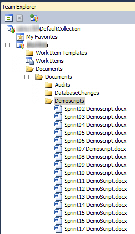

During the Sprint Review Meeting you should demo all features (Sprint goals expressed in PBIs) that you have been working on during the Sprint. Make sure to prepare a demo script, which you can follow easily, because you might be nervous.

The demo script helps if you are going back and want to know what has been done during each Sprint and is nice for documentation purposes as well.

<!--endintro-->
 The demo script should include 3 parts:

1. Committed PBIs
2. Steps to show what has been done aka Demo script itself
3. Give an overview of upcoming PBIs, so that everyone has an idea before you go into the Sprint Planning Meeting

**Figure: Store the demo scripts on TFS**
