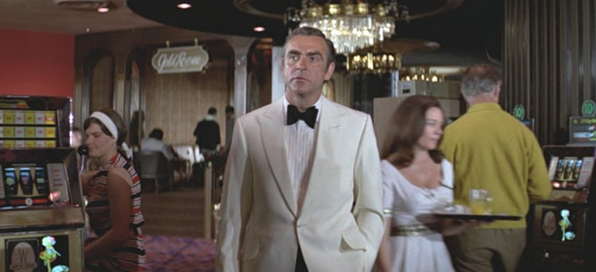
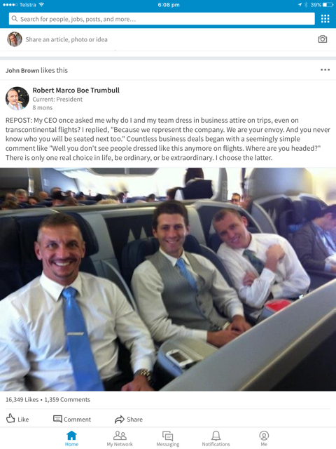
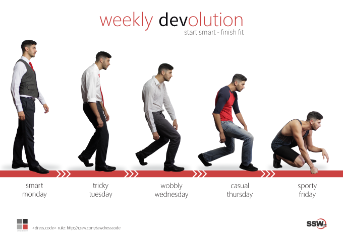

The way you and all members of your team present themselves is a crucial part of creating a good impression for your clients, particularly in their first encounters with you.  

 <excerpt class='endintro'></excerpt> 
<h3>Dressing Up</h3>
One aspect of this is the dress code. Dress code is important for two reasons:
<ul><li>Looking professional and keen for business </li><li>Reinforce the company's <a href=/rules-to-better-branding>branding</a> </li></ul><h3>Public Events and Meetings </h3>
Of course, when in a public event such as a User Group, conference or seeing clients you should "Dress Up".​ 

It should go without saying, but of course, things such as shaving off your weekend facial growth, using deodorant and having clean teeth and nice breath is assumed.
<dl class="image"><dt> 
       
   </dt></dl>
"There is nothing wrong with being the best-dressed man in the room."
- <strong>Sean Connery</strong> 
<h3>On a business flight </h3>It's a good idea to "Dress Up" in flights as you never know who you will be seated next to. 
<dl class="image"><dt> 
       
   </dt><dd>Figure: Why dress up in a flight </dd></dl><h3>Dressing Down (aka Casual Fridays)</h3>
Many companies find it a good idea to have Casual Fridays. It is free and easy to do and gives the team something to look forward to.

E.g. At SSW, our employees <b>"Dress Up"</b> on Mondays and Tuesdays by wearing company colors, with a nice shirt (business or polo), trousers (not blue jeans), belt, nice shoes (no sneakers, joggers or thongs). So most employees wear their SSW shirts on Mondays. Then they <b>"Dress Down"</b> later in the week... so they have 
   <b>"Casual Thursday"</b> and 
   <b>"Sporty Friday"</b>. 

Thursday are casual clothes. On Fridays, they encourage sport clothes, such as shorts. It allows the end of the week to be fun.
<dl class="image"><dt>​</dt><dd>Figure: ​<a href="https://sswcom.sharepoint.com/:b:/s/SSWDESIGN/EfVEIVvnUK5EoEE22SnqtskBlSE3nryQTkLDTjsfGrTV-Q?e=XijWyg">SSW Dress Code can be downloaded here (internal only)</a>​​ </dd></dl><h3 class="ssw15-rteElement-H3">Shorts Days - the cool exception </h3>
On very hot days, shorts are allowed as soon as you've got an email like this:​ 

<b>Subject: SSW Sydney - 🩳 Shorts Today! (Over 30)  </b> Hi All,  The maximum temperature for today is 30.  Feel free to wear shorts if you like 🌞 (hope you haven't skipped leg day 😜)  If you decide against it, then don't forget the SSW dress code 👔 applies as usual (e.g. dress up on Monday and Tuesday - no jeans).  Today's forecast:    &gt; Sunny. Winds north to northwesterly 15 to 20 km/h turning west to southwesterly 20 to 30 km/h in the late morning and afternoon. Note: - At SSW, shorts day is on *only* if this email comes. - Why? We don’t want people looking at different weather apps and having different rules apply... so if it’s over 30 but the email doesn’t come (e.g. there is a bug 🐞), then there’s no shorts that day. Sophie  --Powered by SSW.Shorts  See the code: <a href="https://github.com/SSWConsulting/SSW.Shorts">https://github.com/SSWConsulting/SSW.Shorts</a> SSW Roles and Responsibilities - SSW.Shorts Master  &lt;This email was sent as per: <a href=/do-you-have-a-dress-code>https://rules.ssw.com.au/do-you-have-a-dress-code</a>&gt;

 ​ 

